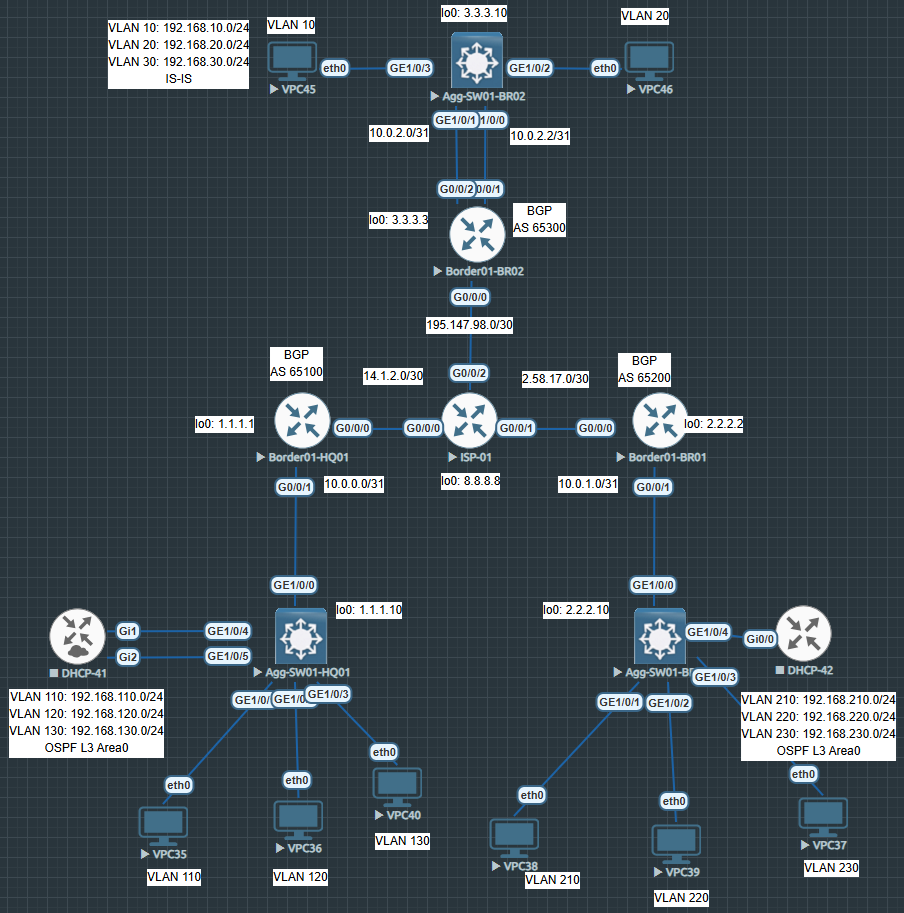

# Hub and Spoke Topology Huawei AR1000v + CE6800

#### [Border01-HQ01 full config](configs/Border01-HQ01.md)

    
display version

    
    <Border01-HQ01>display vers
    Huawei Versatile Routing Platform Software
    VRP (R) software, Version 5.170 (AR1000V V300R019C00SPC300)
    Copyright (C) 2011-2019 HUAWEI TECH CO., LTD
    Huawei AR1000V Router uptime is 0 week, 0 day, 3 hours, 1 minute

    
display ip int b

    <Border01-HQ01>display ip int b
    *down: administratively down
    ^down: standby
    (l): loopback
    (s): spoofing
    (E): E-Trunk down
    The number of interface that is UP in Physical is 13
    The number of interface that is DOWN in Physical is 0
    The number of interface that is UP in Protocol is 6
    The number of interface that is DOWN in Protocol is 7

    Interface                         IP Address/Mask      Physical   Protocol
    GigabitEthernet0/0/0              14.1.2.1/30          up         up
    GigabitEthernet0/0/1              10.0.0.0/31          up         up
    GigabitEthernet0/0/2              unassigned           up         down
    GigabitEthernet0/0/3              unassigned           up         down
    GigabitEthernet0/0/4              unassigned           up         down
    GigabitEthernet0/0/5              unassigned           up         down
    GigabitEthernet0/0/6              unassigned           up         down
    GigabitEthernet0/0/7              unassigned           up         down
    GigabitEthernet0/0/8              unassigned           up         down
    LoopBack0                         1.1.1.1/32           up         up(s)
    NULL0                             unassigned           up         up(s)
    Tunnel0/0/1                       172.16.10.1/30       up         up
    Tunnel0/0/2                       172.16.20.1/30       up         up

    
display ip routing-table protocol ospf

    <Border01-HQ01>display ip routing-table protocol ospf
    Route Flags: R - relay, D - download to fib, T - to vpn-instance
    ------------------------------------------------------------------------------
    Public routing table : OSPF
            Destinations : 4        Routes : 4

    OSPF routing table status : <Active>
            Destinations : 4        Routes : 4

    Destination/Mask    Proto   Pre  Cost      Flags NextHop         Interface

        1.1.1.10/32  OSPF    10   1           D   10.0.0.1        GigabitEthernet0/0/1
    192.168.110.0/24  OSPF    10   2           D   10.0.0.1        GigabitEthernet0/0/1
    192.168.120.0/24  OSPF    10   2           D   10.0.0.1        GigabitEthernet0/0/1
    192.168.130.0/24  OSPF    10   2           D   10.0.0.1        GigabitEthernet0/0/1

    OSPF routing table status : <Inactive>
            Destinations : 0        Routes : 0

    
display bgp peer

    <Border01-HQ01>display bgp peer

    Status codes: * - Dynamic

    BGP local router ID : 14.1.2.1
    Local AS number : 65100
    Total number of peers : 2                Peers in established state : 2
    Total number of dynamic peers : 0

    Peer            V          AS  MsgRcvd  MsgSent  OutQ  Up/Down       State PrefRcv

    172.16.10.2     4       65200      194      197     0 03:08:36 Established       3
    172.16.20.2     4       65300      194      196     0 03:07:48 Established       2

    
display ip routing-table protocol bgp

    <Border01-HQ01>display ip routing-table protocol bgp
    Route Flags: R - relay, D - download to fib, T - to vpn-instance
    ------------------------------------------------------------------------------
    Public routing table : BGP
            Destinations : 5        Routes : 5

    BGP routing table status : <Active>
            Destinations : 5        Routes : 5

    Destination/Mask    Proto   Pre  Cost      Flags NextHop         Interface

    192.168.10.0/24  EBGP    255  20         RD   172.16.20.2     Tunnel0/0/2
    192.168.20.0/24  EBGP    255  20         RD   172.16.20.2     Tunnel0/0/2
    192.168.210.0/24  EBGP    255  2          RD   172.16.10.2     Tunnel0/0/1
    192.168.220.0/24  EBGP    255  2          RD   172.16.10.2     Tunnel0/0/1
    192.168.230.0/24  EBGP    255  2          RD   172.16.10.2     Tunnel0/0/1

    BGP routing table status : <Inactive>
            Destinations : 0        Routes : 0

    
display ipsec sa brief

    <Border01-HQ01>display ipsec sa b

    IPSec SA information:
    Src address                             Dst address                             SPI
    VPN                                     Protocol                                Algorithm
    --------------------------------------------------------------------------------------------------------------------------
    14.1.2.1                                195.147.98.1                            11898564
                                            ESP                                     E:AES-256 A:SHA2_512_256
    195.147.98.1                            14.1.2.1                                2909459
                                            ESP                                     E:AES-256 A:SHA2_512_256
    14.1.2.1                                2.58.17.1                               240680
                                            ESP                                     E:AES-256 A:SHA2_512_256
    2.58.17.1                               14.1.2.1                                14985427
                                            ESP                                     E:AES-256 A:SHA2_512_256

    Number of IPSec SA : 4
    --------------------------------------------------------------------------------------------------------------------------

    
display ike sa

    <Border01-HQ01>
    Conn-ID    Peer                                          VPN              Flag(s)               Phase  RemoteType  RemoteID
    ------------------------------------------------------------------------------------------------------------------------------------
    16         2.58.17.1/500                                                  RD|A                  v2:2   IP          2.58.17.1
    4          2.58.17.1/500                                                  RD|A                  v2:1   IP          2.58.17.1
    17         195.147.98.1/500                                               RD|ST|A               v2:2   IP          195.147.98.1
    6          195.147.98.1/500                                               RD|ST|A               v2:1   IP          195.147.98.1

    Number of IKE SA : 4
    ------------------------------------------------------------------------------------------------------------------------------------

    Flag Description:
    RD--READY   ST--STAYALIVE   RL--REPLACED   FD--FADING   TO--TIMEOUT
    HRT--HEARTBEAT   LKG--LAST KNOWN GOOD SEQ NO.   BCK--BACKED UP
    M--ACTIVE   S--STANDBY   A--ALONE  NEG--NEGOTIATING

#### [Agg-SW01-HQ01 full config](configs/Agg-SW01-HQ01.md)

    
display version

    <Agg-SW01-HQ01>display version
    Huawei Versatile Routing Platform Software
    VRP (R) software, Version 8.180 (CE6800 V200R005C10SPC607B607)
    Copyright (C) 2012-2018 Huawei Technologies Co., Ltd.
    HUAWEI CE6800 uptime is 0 day, 3 hours, 15 minutes
    SVRP Platform Version 1.0

    
display ip int b

    <Agg-SW01-HQ01>display ip int b
    *down: administratively down
    !down: FIB overload down
    ^down: standby
    (l): loopback
    (s): spoofing
    (d): Dampening Suppressed
    The number of interface that is UP in Physical is 7
    The number of interface that is DOWN in Physical is 1
    The number of interface that is UP in Protocol is 6
    The number of interface that is DOWN in Protocol is 2
    Interface                   IP Address/Mask    Physical Protocol VPN
    GE1/0/0                     10.0.0.1/31        up       up       --
    LoopBack0                   1.1.1.10/32        up       up(s)    --
    MEth0/0/0                   unassigned         up       down     --
    NULL0                       unassigned         up       up(s)    --
    Vlanif110                   192.168.110.254/24 up       up       --
    Vlanif120                   192.168.120.254/24 up       up       --
    Vlanif130                   192.168.130.254/24 up       up       --
    Vlanif140                   192.168.140.254/24 down     down     --

    
display ospf peer

    <Agg-SW01-HQ01>display ospf peer
    OSPF Process 1 with Router ID 1.1.1.10
    Area 0.0.0.0 interface 10.0.0.1 (GE1/0/0)'s neighbors
    Router ID: 1.1.1.1            Address : 10.0.0.0
    State    : Full               Mode    : Nbr is Slave       Priority: 1
    DR       : None               BDR     : None               MTU     : 0
    Dead timer due (in seconds) : 30
    Retrans timer interval      : 5
    Neighbor up time            : 02h45m47s
    Neighbor up time stamp      : 2025-06-25 10:26:59
    Authentication Sequence     : 0

    
display ip routing-table protocol ospf

    <Agg-SW01-HQ01>display ip routing-table protocol ospf
    Proto: Protocol        Pre: Preference
    Route Flags: R - relay, D - download to fib, T - to vpn-instance, B - black hole route
    ------------------------------------------------------------------------------
    _public_ Routing Table : OSPF
            Destinations : 7        Routes : 7

    OSPF routing table status : <Active>
            Destinations : 2        Routes : 2

    Destination/Mask    Proto   Pre  Cost        Flags NextHop         Interface

            0.0.0.0/0   O_ASE   150  1             D   10.0.0.0        GE1/0/0
            1.1.1.1/32  OSPF    10   1             D   10.0.0.0        GE1/0/0

    OSPF routing table status : <Inactive>
            Destinations : 5        Routes : 5

    Destination/Mask    Proto   Pre  Cost        Flags NextHop         Interface

        1.1.1.10/32  OSPF    10   0                 1.1.1.10        LoopBack0
        10.0.0.0/31  OSPF    10   1                 10.0.0.1        GE1/0/0
    192.168.110.0/24  OSPF    10   1                 192.168.110.254 Vlanif110
    192.168.120.0/24  OSPF    10   1                 192.168.120.254 Vlanif120
    192.168.130.0/24  OSPF    10   1                 192.168.130.254 Vlanif130

    
display eth-trunk

    <Agg-SW01-HQ01>display eth-trunk
    Eth-Trunk10's state information is:
    Local:
    LAG ID: 10                      Working Mode: Static
    Preempt Delay: Disabled         Hash Arithmetic: According to flow
    System Priority: 32768          System ID: 708c-9b8c-d9c0
    Least Active-linknumber: 1      Max Active-linknumber: 32
    Operating Status: up            Number Of Up Ports In Trunk: 2
    Timeout Period: Slow
    --------------------------------------------------------------------------------
    ActorPortName          Status   PortType PortPri PortNo PortKey PortState Weight
    GE1/0/4                Selected 100M     32768   1      2593    10111100  1
    GE1/0/5                Selected 100M     32768   2      2593    10111100  1

    Partner:
    --------------------------------------------------------------------------------
    ActorPortName          SysPri   SystemID        PortPri PortNo PortKey PortState
    GE1/0/4                32768    001e-49c3-7400  32768   1      1       10111100
    GE1/0/5                32768    001e-49c3-7400  32768   1      1       10111100

#### Cisco EtherChannel status

    
sh etherchannel summary

    Router#sh etherchannel summary
    Flags:  D - down        P/bndl - bundled in port-channel
        I - stand-alone s/susp - suspended
        H - Hot-standby (LACP only)
        R - Layer3      S - Layer2
        U - in use      f - failed to allocate aggregator

        M - not in use, minimum links not met
        u - unsuitable for bundling
        w - waiting to be aggregated
        d - default port

    Number of channel-groups in use: 1
    Number of aggregators:           1

    Group  Port-channel  Protocol    Ports
    ------+-------------+-----------+-----------------------------------------------
    1       Po1(RU)         LACP     Gi1(bndl) Gi2(bndl)

    RU - L3 port-channel UP State
    SU - L2 port-channel UP state
    P/bndl -  Bundled
    S/susp  - Suspended

#### [Border01-BR01 full config](configs/Border01-BR01.md)

    
display version

    <Border01-BR01>display ver
    Huawei Versatile Routing Platform Software
    VRP (R) software, Version 5.170 (AR1000V V300R019C00SPC300)
    Copyright (C) 2011-2019 HUAWEI TECH CO., LTD
    Huawei AR1000V Router uptime is 0 week, 0 day, 3 hours, 20 minutes

    
display ip int b

    <Border01-BR01>display ip int b
    *down: administratively down
    ^down: standby
    (l): loopback
    (s): spoofing
    (E): E-Trunk down
    The number of interface that is UP in Physical is 12
    The number of interface that is DOWN in Physical is 0
    The number of interface that is UP in Protocol is 5
    The number of interface that is DOWN in Protocol is 7

    Interface                         IP Address/Mask      Physical   Protocol
    GigabitEthernet0/0/0              2.58.17.1/30         up         up
    GigabitEthernet0/0/1              10.0.1.0/31          up         up
    GigabitEthernet0/0/2              unassigned           up         down
    GigabitEthernet0/0/3              unassigned           up         down
    GigabitEthernet0/0/4              unassigned           up         down
    GigabitEthernet0/0/5              unassigned           up         down
    GigabitEthernet0/0/6              unassigned           up         down
    GigabitEthernet0/0/7              unassigned           up         down
    GigabitEthernet0/0/8              unassigned           up         down
    LoopBack0                         2.2.2.2/32           up         up(s)
    NULL0                             unassigned           up         up(s)
    Tunnel0/0/1                       172.16.10.2/30       up         up

    
display ip routing-table protocol ospf

    <Border01-BR01>display ip routing-table protocol ospf
    Route Flags: R - relay, D - download to fib, T - to vpn-instance
    ------------------------------------------------------------------------------
    Public routing table : OSPF
            Destinations : 4        Routes : 4

    OSPF routing table status : <Active>
            Destinations : 4        Routes : 4

    Destination/Mask    Proto   Pre  Cost      Flags NextHop         Interface

        2.2.2.10/32  OSPF    10   1           D   10.0.1.1        GigabitEthernet0/0/1
    192.168.210.0/24  OSPF    10   2           D   10.0.1.1        GigabitEthernet0/0/1
    192.168.220.0/24  OSPF    10   2           D   10.0.1.1        GigabitEthernet0/0/1
    192.168.230.0/24  OSPF    10   2           D   10.0.1.1        GigabitEthernet0/0/1

    OSPF routing table status : <Inactive>
            Destinations : 0        Routes : 0

    
display bgp peer

    <Border01-BR01>display bgp peer

    Status codes: * - Dynamic

    BGP local router ID : 2.58.17.1
    Local AS number : 65200
    Total number of peers : 1                Peers in established state : 1
    Total number of dynamic peers : 0

    Peer            V          AS  MsgRcvd  MsgSent  OutQ  Up/Down       State PrefRcv

    172.16.10.1     4       65100      212      209     0 03:24:00 Established       5

    
display ip routing-table protocol bgp

    <Border01-BR01>display ip routing-table protocol bgp
    Route Flags: R - relay, D - download to fib, T - to vpn-instance
    ------------------------------------------------------------------------------
    Public routing table : BGP
            Destinations : 5        Routes : 5

    BGP routing table status : <Active>
            Destinations : 5        Routes : 5

    Destination/Mask    Proto   Pre  Cost      Flags NextHop         Interface

    192.168.10.0/24  EBGP    255  0          RD   172.16.10.1     Tunnel0/0/1
    192.168.20.0/24  EBGP    255  0          RD   172.16.10.1     Tunnel0/0/1
    192.168.110.0/24  EBGP    255  2          RD   172.16.10.1     Tunnel0/0/1
    192.168.120.0/24  EBGP    255  2          RD   172.16.10.1     Tunnel0/0/1
    192.168.130.0/24  EBGP    255  2          RD   172.16.10.1     Tunnel0/0/1

    BGP routing table status : <Inactive>
            Destinations : 0        Routes : 0

    
display ipsec sa brief

    <Border01-BR01>display ipsec sa b

    IPSec SA information:
    Src address                             Dst address                             SPI
    VPN                                     Protocol                                Algorithm
    --------------------------------------------------------------------------------------------------------------------------
    14.1.2.1                                2.58.17.1                               240680
                                            ESP                                     E:AES-256 A:SHA2_512_256
    2.58.17.1                               14.1.2.1                                14985427
                                            ESP                                     E:AES-256 A:SHA2_512_256

    Number of IPSec SA : 2
    --------------------------------------------------------------------------------------------------------------------------

    
display ike sa

    <Border01-BR01>display ike sa
    Conn-ID    Peer                                          VPN              Flag(s)               Phase  RemoteType  RemoteID
    ------------------------------------------------------------------------------------------------------------------------------------
    9          14.1.2.1/500                                                   RD|A                  v2:2   IP          14.1.2.1
    1          14.1.2.1/500                                                   RD|ST|A               v2:1   IP          14.1.2.1

    Number of IKE SA : 2
    ------------------------------------------------------------------------------------------------------------------------------------

    Flag Description:
    RD--READY   ST--STAYALIVE   RL--REPLACED   FD--FADING   TO--TIMEOUT
    HRT--HEARTBEAT   LKG--LAST KNOWN GOOD SEQ NO.   BCK--BACKED UP
    M--ACTIVE   S--STANDBY   A--ALONE  NEG--NEGOTIATING

#### [Agg-SW01-BR01 full config](configs/Agg-SW01-BR01.md)

    
display version

    <Agg-SW01-BR01>display vers
    Huawei Versatile Routing Platform Software
    VRP (R) software, Version 8.180 (CE6800 V200R005C10SPC607B607)
    Copyright (C) 2012-2018 Huawei Technologies Co., Ltd.
    HUAWEI CE6800 uptime is 0 day, 3 hours, 42 minutes
    SVRP Platform Version 1.0

    
display ip int b

    <Agg-SW01-BR01>display ip int b
    *down: administratively down
    !down: FIB overload down
    ^down: standby
    (l): loopback
    (s): spoofing
    (d): Dampening Suppressed
    The number of interface that is UP in Physical is 7
    The number of interface that is DOWN in Physical is 0
    The number of interface that is UP in Protocol is 6
    The number of interface that is DOWN in Protocol is 1
    Interface                   IP Address/Mask    Physical Protocol VPN
    GE1/0/0                     10.0.1.1/31        up       up       --
    LoopBack0                   2.2.2.10/32        up       up(s)    --
    MEth0/0/0                   unassigned         up       down     --
    NULL0                       unassigned         up       up(s)    --
    Vlanif210                   192.168.210.254/24 up       up       --
    Vlanif220                   192.168.220.254/24 up       up       --
    Vlanif230                   192.168.230.254/24 up       up       --

    
display ospf peer

    <Agg-SW01-BR01>display ospf peer
    OSPF Process 1 with Router ID 2.2.2.10
    Area 0.0.0.0 interface 10.0.1.1 (GE1/0/0)'s neighbors
    Router ID: 2.2.2.2            Address : 10.0.1.0
    State    : Full               Mode    : Nbr is Slave       Priority: 1
    DR       : None               BDR     : None               MTU     : 0
    Dead timer due (in seconds) : 36
    Retrans timer interval      : 5
    Neighbor up time            : 03h43m27s
    Neighbor up time stamp      : 2025-06-25 10:27:06
    Authentication Sequence     : 0

    
display ip routing-table protocol ospf

    <Agg-SW01-BR01>display ip routing-table protocol ospf
    Proto: Protocol        Pre: Preference
    Route Flags: R - relay, D - download to fib, T - to vpn-instance, B - black hole route
    ------------------------------------------------------------------------------
    _public_ Routing Table : OSPF
            Destinations : 7        Routes : 7

    OSPF routing table status : <Active>
            Destinations : 2        Routes : 2

    Destination/Mask    Proto   Pre  Cost        Flags NextHop         Interface

            0.0.0.0/0   O_ASE   150  1             D   10.0.1.0        GE1/0/0
            2.2.2.2/32  OSPF    10   1             D   10.0.1.0        GE1/0/0

    OSPF routing table status : <Inactive>
            Destinations : 5        Routes : 5

    Destination/Mask    Proto   Pre  Cost        Flags NextHop         Interface

        2.2.2.10/32  OSPF    10   0                 2.2.2.10        LoopBack0
        10.0.1.0/31  OSPF    10   1                 10.0.1.1        GE1/0/0
    192.168.210.0/24  OSPF    10   1                 192.168.210.254 Vlanif210
    192.168.220.0/24  OSPF    10   1                 192.168.220.254 Vlanif220
    192.168.230.0/24  OSPF    10   1                 192.168.230.254 Vlanif230

#### [Border01-BR02 full config](configs/Border01-BR02.md)

    
display version

    <Border01-BR02>display vers
    Huawei Versatile Routing Platform Software
    VRP (R) software, Version 5.170 (AR1000V V300R019C00SPC300)
    Copyright (C) 2011-2019 HUAWEI TECH CO., LTD
    Huawei AR1000V Router uptime is 0 week, 0 day, 3 hours, 31 minutes

    
display ip int b

    <Border01-BR02>display ip int b
    *down: administratively down
    ^down: standby
    (l): loopback
    (s): spoofing
    (E): E-Trunk down
    The number of interface that is UP in Physical is 12
    The number of interface that is DOWN in Physical is 0
    The number of interface that is UP in Protocol is 6
    The number of interface that is DOWN in Protocol is 6

    Interface                         IP Address/Mask      Physical   Protocol
    GigabitEthernet0/0/0              195.147.98.1/30      up         up
    GigabitEthernet0/0/1              10.0.2.3/31          up         up
    GigabitEthernet0/0/2              10.0.2.1/31          up         up
    GigabitEthernet0/0/3              unassigned           up         down
    GigabitEthernet0/0/4              unassigned           up         down
    GigabitEthernet0/0/5              unassigned           up         down
    GigabitEthernet0/0/6              unassigned           up         down
    GigabitEthernet0/0/7              unassigned           up         down
    GigabitEthernet0/0/8              unassigned           up         down
    LoopBack0                         3.3.3.3/32           up         up(s)
    NULL0                             unassigned           up         up(s)
    Tunnel0/0/1                       172.16.20.2/30       up         up

    
display ip routing-table protocol isis

    <Border01-BR02>display ip routing-table protocol isis
    Route Flags: R - relay, D - download to fib, T - to vpn-instance
    ------------------------------------------------------------------------------
    Public routing table : ISIS
            Destinations : 3        Routes : 6

    ISIS routing table status : <Active>
            Destinations : 3        Routes : 6

    Destination/Mask    Proto   Pre  Cost      Flags NextHop         Interface

        3.3.3.10/32  ISIS-L1 15   10          D   10.0.2.2        GigabitEthernet0/0/1
                     ISIS-L1 15   10          D   10.0.2.0        GigabitEthernet0/0/2
    192.168.10.0/24  ISIS-L1 15   20          D   10.0.2.2        GigabitEthernet0/0/1
                     ISIS-L1 15   20          D   10.0.2.0        GigabitEthernet0/0/2
    192.168.20.0/24  ISIS-L1 15   20          D   10.0.2.2        GigabitEthernet0/0/1
                     ISIS-L1 15   20          D   10.0.2.0        GigabitEthernet0/0/2

    ISIS routing table status : <Inactive>
            Destinations : 0        Routes : 0

    
display bgp peer

    <Border01-BR02>display bgp peer

    Status codes: * - Dynamic

    BGP local router ID : 195.147.98.1
    Local AS number : 65300
    Total number of peers : 1                Peers in established state : 1
    Total number of dynamic peers : 0

    Peer            V          AS  MsgRcvd  MsgSent  OutQ  Up/Down       State PrefRcv

    172.16.20.1     4       65100      218      217     0 03:30:33 Established       6

    
display ip routing-table protocol bgp

    <Border01-BR02>display ip routing-table protocol bgp
    Route Flags: R - relay, D - download to fib, T - to vpn-instance
    ------------------------------------------------------------------------------
    Public routing table : BGP
            Destinations : 6        Routes : 6

    BGP routing table status : <Active>
            Destinations : 6        Routes : 6

    Destination/Mask    Proto   Pre  Cost      Flags NextHop         Interface

    192.168.110.0/24  EBGP    255  2          RD   172.16.20.1     Tunnel0/0/1
    192.168.120.0/24  EBGP    255  2          RD   172.16.20.1     Tunnel0/0/1
    192.168.130.0/24  EBGP    255  2          RD   172.16.20.1     Tunnel0/0/1
    192.168.210.0/24  EBGP    255  0          RD   172.16.20.1     Tunnel0/0/1
    192.168.220.0/24  EBGP    255  0          RD   172.16.20.1     Tunnel0/0/1
    192.168.230.0/24  EBGP    255  0          RD   172.16.20.1     Tunnel0/0/1

    BGP routing table status : <Inactive>
            Destinations : 0        Routes : 0

    
display ipsec sa b

    <Border01-BR02>display ipsec sa b

    IPSec SA information:
    Src address                             Dst address                             SPI
    VPN                                     Protocol                                Algorithm
    --------------------------------------------------------------------------------------------------------------------------
    14.1.2.1                                195.147.98.1                            11898564
                                            ESP                                     E:AES-256 A:SHA2_512_256
    195.147.98.1                            14.1.2.1                                2909459
                                            ESP                                     E:AES-256 A:SHA2_512_256

    Number of IPSec SA : 2
    --------------------------------------------------------------------------------------------------------------------------

    
display ike sa

    <Border01-BR02>display ike sa
    Conn-ID    Peer                                          VPN              Flag(s)               Phase  RemoteType  RemoteID
    ------------------------------------------------------------------------------------------------------------------------------------
    8          14.1.2.1/500                                                   RD|A                  v2:2   IP          14.1.2.1
    3          14.1.2.1/500                                                   RD|A                  v2:1   IP          14.1.2.1

    Number of IKE SA : 2
    ------------------------------------------------------------------------------------------------------------------------------------

#### [Agg-SW01-BR02 full config](configs/Agg-SW01-BR02.md)

    
display version

    <Agg-SW01-BR02>display version
    Huawei Versatile Routing Platform Software
    VRP (R) software, Version 8.180 (CE6800 V200R005C10SPC607B607)
    Copyright (C) 2012-2018 Huawei Technologies Co., Ltd.
    HUAWEI CE6800 uptime is 0 day, 3 hours, 49 minutes
    SVRP Platform Version 1.0

    
display ip int b | include up

    <Agg-SW01-BR02>display ip int b | i up
    *down: administratively down
    !down: FIB overload down
    ^down: standby
    (l): loopback
    (s): spoofing
    (d): Dampening Suppressed
    The number of interface that is UP in Physical is 7
    The number of interface that is DOWN in Physical is 1
    The number of interface that is UP in Protocol is 6
    The number of interface that is DOWN in Protocol is 2
    Interface                   IP Address/Mask    Physical Protocol VPN
    GE1/0/0                     10.0.2.2/31        up       up       --
    GE1/0/1                     10.0.2.0/31        up       up       --
    LoopBack0                   3.3.3.10/32        up       up(s)    --
    MEth0/0/0                   unassigned         up       down     --
    NULL0                       unassigned         up       up(s)    --
    Vlanif10                    192.168.10.254/24  up       up       --
    Vlanif20                    192.168.20.254/24  up       up       --

    
display isis peer

    <Agg-SW01-BR02>display isis peer

    Peer Information for ISIS(1)
    --------------------------------------------------------------------------------

    System ID     Interface       Circuit ID        State HoldTime(s) Type     PRI
    --------------------------------------------------------------------------------
    0000.0000.0001  GE1/0/0         0000000001         Up            24 L1L2      --
    0000.0000.0001  GE1/0/1         0000000002         Up            24 L1L2      --

    Total Peer(s): 2

    
display ip routing-table protocol isis

    <Agg-SW01-BR02>display ip routing-table protocol isis
    Proto: Protocol        Pre: Preference
    Route Flags: R - relay, D - download to fib, T - to vpn-instance, B - black hole route
    ------------------------------------------------------------------------------
    _public_ Routing Table : IS-IS
            Destinations : 7        Routes : 9

    IS-IS routing table status : <Active>
            Destinations : 2        Routes : 4

    Destination/Mask    Proto   Pre  Cost        Flags NextHop         Interface

            0.0.0.0/0   ISIS-L2 15   10            D   10.0.2.3        GE1/0/0
                        ISIS-L2 15   10            D   10.0.2.1        GE1/0/1
            3.3.3.3/32  ISIS-L1 15   10            D   10.0.2.3        GE1/0/0
                        ISIS-L1 15   10            D   10.0.2.1        GE1/0/1

    IS-IS routing table status : <Inactive>
            Destinations : 5        Routes : 5

    Destination/Mask    Proto   Pre  Cost        Flags NextHop         Interface

        3.3.3.10/32  ISIS-L1 15   0                 3.3.3.10        LoopBack0
        10.0.2.0/31  ISIS-L1 15   0                 10.0.2.0        GE1/0/1
        10.0.2.2/31  ISIS-L1 15   0                 10.0.2.2        GE1/0/0
    192.168.10.0/24  ISIS-L1 15   0                 192.168.10.254  Vlanif10
    192.168.20.0/24  ISIS-L1 15   0                 192.168.20.254  Vlanif20

#### [ISP-01 full config](configs/ISP-01.md)

    
display version

    <ISP-01>display version
    Huawei Versatile Routing Platform Software
    VRP (R) software, Version 5.170 (AR1000V V300R019C00SPC300)
    Copyright (C) 2011-2019 HUAWEI TECH CO., LTD
    Huawei AR1000V Router uptime is 0 week, 0 day, 21 hours, 36 minutes

    
disp ip int b | i up

    <ISP-01>disp ip int b | i up
    *down: administratively down
    ^down: standby
    (l): loopback
    (s): spoofing
    (E): E-Trunk down
    The number of interface that is UP in Physical is 11
    The number of interface that is DOWN in Physical is 0
    The number of interface that is UP in Protocol is 5
    The number of interface that is DOWN in Protocol is 6

    Interface                         IP Address/Mask      Physical   Protocol
    GigabitEthernet0/0/0              14.1.2.2/30          up         up
    GigabitEthernet0/0/1              2.58.17.2/30         up         up
    GigabitEthernet0/0/2              195.147.98.2/30      up         up
    GigabitEthernet0/0/3              unassigned           up         down
    GigabitEthernet0/0/4              unassigned           up         down
    GigabitEthernet0/0/5              unassigned           up         down
    GigabitEthernet0/0/6              unassigned           up         down
    GigabitEthernet0/0/7              unassigned           up         down
    GigabitEthernet0/0/8              unassigned           up         down
    LoopBack0                         8.8.8.8/32           up         up(s)
    NULL0                             unassigned           up         up(s)

### Check NAT and Internet connectivity

    
VLAN 10 Branch 02

    NAME        : VPCS[1]
    IP/MASK     : 192.168.10.10/24
    GATEWAY     : 192.168.10.254
    DNS         :
    MAC         : 00:50:79:66:68:2d
    LPORT       : 20000
    RHOST:PORT  : 127.0.0.1:30000
    MTU         : 1500

    VPCS> ping 8.8.8.8 -c 3

    84 bytes from 8.8.8.8 icmp_seq=1 ttl=253 time=2.745 ms
    84 bytes from 8.8.8.8 icmp_seq=2 ttl=253 time=2.001 ms
    84 bytes from 8.8.8.8 icmp_seq=3 ttl=253 time=1.977 ms

    
VLAN 20 Branch 02

    NAME        : VPCS[1]
    IP/MASK     : 192.168.20.20/24
    GATEWAY     : 192.168.20.254
    DNS         :
    MAC         : 00:50:79:66:68:2e
    LPORT       : 20000
    RHOST:PORT  : 127.0.0.1:30000
    MTU         : 1500

    VPCS> ping 8.8.8.8 -c 3

    84 bytes from 8.8.8.8 icmp_seq=1 ttl=253 time=3.114 ms
    84 bytes from 8.8.8.8 icmp_seq=2 ttl=253 time=2.439 ms
    84 bytes from 8.8.8.8 icmp_seq=3 ttl=253 time=2.088 ms

    
Border01-BR02 ACL matches

    <Border01-BR02>display acl 2000
    Basic ACL 2000, 4 rules
    Acl's step is 5
    rule 5 permit source 192.168.10.0 0.0.0.255 (13 matches)
    rule 10 permit source 192.168.20.0 0.0.0.255 (6 matches)
    rule 15 permit source 192.168.30.0 0.0.0.255
    rule 20 deny

    
VLAN 110 HQ

    NAME        : VPCS[1]
    IP/MASK     : 192.168.110.10/24
    GATEWAY     : 192.168.110.254
    DNS         : 192.168.110.254
    MAC         : 00:50:79:66:68:23
    LPORT       : 20000
    RHOST:PORT  : 127.0.0.1:30000
    MTU         : 1500

    VPCS> ping 8.8.8.8 -c 3

    84 bytes from 8.8.8.8 icmp_seq=1 ttl=253 time=3.327 ms
    84 bytes from 8.8.8.8 icmp_seq=2 ttl=253 time=2.987 ms
    84 bytes from 8.8.8.8 icmp_seq=3 ttl=253 time=2.106 ms

    
VLAN 120 HQ

    NAME        : VPCS[1]
    IP/MASK     : 192.168.120.20/24
    GATEWAY     : 192.168.120.254
    DNS         :
    MAC         : 00:50:79:66:68:24
    LPORT       : 20000
    RHOST:PORT  : 127.0.0.1:30000
    MTU         : 1500

    VPCS> ping 8.8.8.8 -c 3

    84 bytes from 8.8.8.8 icmp_seq=1 ttl=253 time=1.868 ms
    84 bytes from 8.8.8.8 icmp_seq=2 ttl=253 time=1.932 ms
    84 bytes from 8.8.8.8 icmp_seq=3 ttl=253 time=2.651 ms

    
VLAN 130 HQ

    NAME        : VPCS[1]
    IP/MASK     : 192.168.130.30/24
    GATEWAY     : 192.168.130.254
    DNS         :
    MAC         : 00:50:79:66:68:28
    LPORT       : 20000
    RHOST:PORT  : 127.0.0.1:30000
    MTU         : 1500

    VPCS> ping 8.8.8.8 -c 3

    84 bytes from 8.8.8.8 icmp_seq=1 ttl=253 time=2.739 ms
    84 bytes from 8.8.8.8 icmp_seq=2 ttl=253 time=2.387 ms
    84 bytes from 8.8.8.8 icmp_seq=3 ttl=253 time=2.008 ms

    
Border01-HQ01 ACL matches

    <Border01-HQ01>display acl 2000
    Basic ACL 2000, 4 rules
    Acl's step is 5
    rule 5 permit source 192.168.110.0 0.0.0.255 (3 matches)
    rule 10 permit source 192.168.120.0 0.0.0.255 (3 matches)
    rule 15 permit source 192.168.130.0 0.0.0.255 (8 matches)
    rule 20 deny

    
VLAN 210 Branch 01

    NAME        : VPCS[1]
    IP/MASK     : 192.168.210.10/24
    GATEWAY     : 192.168.210.254
    DNS         :
    MAC         : 00:50:79:66:68:26
    LPORT       : 20000
    RHOST:PORT  : 127.0.0.1:30000
    MTU         : 1500

    VPCS> ping 8.8.8.8 -c 3

    84 bytes from 8.8.8.8 icmp_seq=1 ttl=253 time=3.990 ms
    84 bytes from 8.8.8.8 icmp_seq=2 ttl=253 time=2.046 ms
    84 bytes from 8.8.8.8 icmp_seq=3 ttl=253 time=2.540 ms

    
VLAN 220 Branch 01

    NAME        : VPCS[1]
    IP/MASK     : 192.168.220.20/24
    GATEWAY     : 192.168.220.254
    DNS         :
    MAC         : 00:50:79:66:68:27
    LPORT       : 20000
    RHOST:PORT  : 127.0.0.1:30000
    MTU         : 1500

    VPCS> ping 8.8.8.8 -c 3

    84 bytes from 8.8.8.8 icmp_seq=1 ttl=253 time=1.528 ms
    84 bytes from 8.8.8.8 icmp_seq=2 ttl=253 time=1.897 ms
    84 bytes from 8.8.8.8 icmp_seq=3 ttl=253 time=2.092 ms

    
VLAN 230 Branch 01

    NAME        : VPCS[1]
    IP/MASK     : 192.168.230.30/24
    GATEWAY     : 192.168.230.254
    DNS         :
    MAC         : 00:50:79:66:68:25
    LPORT       : 20000
    RHOST:PORT  : 127.0.0.1:30000
    MTU         : 1500

    VPCS> ping 8.8.8.8 -c 3

    84 bytes from 8.8.8.8 icmp_seq=1 ttl=253 time=1.702 ms
    84 bytes from 8.8.8.8 icmp_seq=2 ttl=253 time=2.207 ms
    84 bytes from 8.8.8.8 icmp_seq=3 ttl=253 time=1.934 ms

    
Border01-BR01 ACL matches

    <Border01-BR01>display acl 2000
    Basic ACL 2000, 4 rules
    Acl's step is 5
    rule 5 permit source 192.168.210.0 0.0.0.255 (6 matches)
    rule 10 permit source 192.168.220.0 0.0.0.255 (6 matches)
    rule 15 permit source 192.168.230.0 0.0.0.255 (11 matches)
    rule 20 deny

### Check Tunnel connectivity

    
From HQ to Branch 01

    NAME        : VPCS[1]
    IP/MASK     : 192.168.110.10/24
    GATEWAY     : 192.168.110.254
    DNS         : 192.168.110.254
    MAC         : 00:50:79:66:68:23
    LPORT       : 20000
    RHOST:PORT  : 127.0.0.1:30000
    MTU         : 1500

    VPCS> ping 192.168.10.10 -c 3

    84 bytes from 192.168.10.10 icmp_seq=1 ttl=60 time=13.473 ms
    84 bytes from 192.168.10.10 icmp_seq=2 ttl=60 time=7.663 ms
    84 bytes from 192.168.10.10 icmp_seq=3 ttl=60 time=6.367 ms

    VPCS> ping 192.168.20.20 -c 3

    84 bytes from 192.168.20.20 icmp_seq=1 ttl=60 time=10.810 ms
    84 bytes from 192.168.20.20 icmp_seq=2 ttl=60 time=6.923 ms
    84 bytes from 192.168.20.20 icmp_seq=3 ttl=60 time=7.925 ms

   
From HQ to Branch 02

    NAME        : VPCS[1]
    IP/MASK     : 192.168.110.10/24
    GATEWAY     : 192.168.110.254
    DNS         : 192.168.110.254
    MAC         : 00:50:79:66:68:23
    LPORT       : 20000
    RHOST:PORT  : 127.0.0.1:30000
    MTU         : 1500

    VPCS> ping 192.168.210.10 -c 3

    84 bytes from 192.168.210.10 icmp_seq=1 ttl=60 time=8.976 ms
    84 bytes from 192.168.210.10 icmp_seq=2 ttl=60 time=7.053 ms
    84 bytes from 192.168.210.10 icmp_seq=3 ttl=60 time=6.672 ms

    VPCS> ping 192.168.220.20 -c 3

    84 bytes from 192.168.220.20 icmp_seq=1 ttl=60 time=9.236 ms
    84 bytes from 192.168.220.20 icmp_seq=2 ttl=60 time=8.123 ms
    84 bytes from 192.168.220.20 icmp_seq=3 ttl=60 time=7.247 ms

    VPCS> ping 192.168.230.30 -c 3

    84 bytes from 192.168.230.30 icmp_seq=1 ttl=60 time=8.117 ms
    84 bytes from 192.168.230.30 icmp_seq=2 ttl=60 time=8.451 ms
    84 bytes from 192.168.230.30 icmp_seq=3 ttl=60 time=4.663 ms

    
From Branch 01 to Branch 02

    NAME        : VPCS[1]
    IP/MASK     : 192.168.220.20/24
    GATEWAY     : 192.168.220.254
    DNS         :
    MAC         : 00:50:79:66:68:27
    LPORT       : 20000
    RHOST:PORT  : 127.0.0.1:30000
    MTU         : 1500

    VPCS> ping 192.168.10.10 -c 3

    84 bytes from 192.168.10.10 icmp_seq=1 ttl=59 time=12.489 ms
    84 bytes from 192.168.10.10 icmp_seq=2 ttl=59 time=10.401 ms
    84 bytes from 192.168.10.10 icmp_seq=3 ttl=59 time=14.660 ms

    VPCS> ping 192.168.20.20 -c 3

    84 bytes from 192.168.20.20 icmp_seq=1 ttl=59 time=13.374 ms
    84 bytes from 192.168.20.20 icmp_seq=2 ttl=59 time=10.889 ms
    84 bytes from 192.168.20.20 icmp_seq=3 ttl=59 time=13.471 ms

    
Tracert from Branch 01

    NAME        : VPCS[1]
    IP/MASK     : 192.168.220.20/24
    GATEWAY     : 192.168.220.254
    DNS         :
    MAC         : 00:50:79:66:68:27
    LPORT       : 20000
    RHOST:PORT  : 127.0.0.1:30000
    MTU         : 1500

    VPCS> trace 192.168.10.10 -P 1
    trace to 192.168.10.10, 8 hops max (ICMP), press Ctrl+C to stop
    1   192.168.220.254   4.274 ms  1.026 ms  0.825 ms
    2   10.0.1.0   6.317 ms  8.018 ms  5.600 ms
    3   172.16.10.1   8.656 ms  12.895 ms  8.293 ms
    4   172.16.20.2   13.364 ms  13.165 ms  14.289 ms
    5   10.0.2.2   13.012 ms  10.468 ms  10.961 ms
    6   192.168.10.10   11.924 ms  11.986 ms  9.160 ms

    VPCS> trace 192.168.20.20 -P 1
    trace to 192.168.20.20, 8 hops max (ICMP), press Ctrl+C to stop
    1   192.168.220.254   5.000 ms  1.036 ms  0.825 ms
    2   10.0.1.0   5.701 ms  4.666 ms  3.809 ms
    3   172.16.10.1   7.985 ms  9.941 ms  13.568 ms
    4   172.16.20.2   13.479 ms  12.973 ms  14.480 ms
    5   10.0.2.2   15.023 ms  9.474 ms  8.189 ms
    6   192.168.20.20   15.522 ms  10.690 ms  10.563 ms

    

    
Tracert from Branch 02

    NAME        : VPCS[1]
    IP/MASK     : 192.168.20.20/24
    GATEWAY     : 192.168.20.254
    DNS         :
    MAC         : 00:50:79:66:68:2e
    LPORT       : 20000
    RHOST:PORT  : 127.0.0.1:30000
    MTU         : 1500

    VPCS> trace 192.168.110.10 -P 1
    trace to 192.168.110.10, 8 hops max (ICMP), press Ctrl+C to stop
    1   192.168.20.254   4.494 ms  0.963 ms  0.806 ms
    2   10.0.2.1   5.014 ms  3.441 ms  5.638 ms
    3   172.16.20.1   9.150 ms  8.669 ms  12.742 ms
    4   10.0.0.1   22.344 ms  8.755 ms  6.997 ms
    5   192.168.110.10   6.610 ms  6.782 ms  7.380 ms

    VPCS> trace 192.168.230.30 -P 1
    trace to 192.168.230.30, 8 hops max (ICMP), press Ctrl+C to stop
    1   192.168.20.254   3.454 ms  1.295 ms  1.181 ms
    2   10.0.2.1   5.356 ms  7.253 ms  3.723 ms
    3   172.16.20.1   9.490 ms  9.953 ms  11.376 ms
    4   172.16.10.2   13.284 ms  14.037 ms  15.375 ms
    5   10.0.1.1   14.616 ms  10.290 ms  11.622 ms
    6   192.168.230.30   14.632 ms  10.351 ms  12.057 ms

### Inside connectivity

    
HQ

    NAME        : VPCS[1]
    IP/MASK     : 192.168.130.30/24
    GATEWAY     : 192.168.130.254
    DNS         :
    MAC         : 00:50:79:66:68:28
    LPORT       : 20000
    RHOST:PORT  : 127.0.0.1:30000
    MTU         : 1500

    VPCS> ping 192.168.110.10 -c 3

    84 bytes from 192.168.110.10 icmp_seq=1 ttl=63 time=4.012 ms
    84 bytes from 192.168.110.10 icmp_seq=2 ttl=63 time=1.190 ms
    84 bytes from 192.168.110.10 icmp_seq=3 ttl=63 time=1.310 ms

    VPCS> ping 192.168.120.20 -c 3

    84 bytes from 192.168.120.20 icmp_seq=1 ttl=63 time=3.428 ms
    84 bytes from 192.168.120.20 icmp_seq=2 ttl=63 time=1.287 ms
    84 bytes from 192.168.120.20 icmp_seq=3 ttl=63 time=1.607 ms

    VPCS> ping 1.1.1.1 -c 3

    84 bytes from 1.1.1.1 icmp_seq=1 ttl=254 time=2.239 ms
    84 bytes from 1.1.1.1 icmp_seq=2 ttl=254 time=2.288 ms
    84 bytes from 1.1.1.1 icmp_seq=3 ttl=254 time=1.588 ms

    VPCS> ping 1.1.1.10 -c 3

    84 bytes from 1.1.1.10 icmp_seq=1 ttl=255 time=19.684 ms
    84 bytes from 1.1.1.10 icmp_seq=2 ttl=255 time=1.571 ms
    84 bytes from 1.1.1.10 icmp_seq=3 ttl=255 time=1.198 ms

    
Branch 02

    NAME        : VPCS[1]
    IP/MASK     : 192.168.10.10/24
    GATEWAY     : 192.168.10.254
    DNS         :
    MAC         : 00:50:79:66:68:2d
    LPORT       : 20000
    RHOST:PORT  : 127.0.0.1:30000
    MTU         : 1500

    VPCS> ping 192.168.20.20 -c 3

    84 bytes from 192.168.20.20 icmp_seq=1 ttl=63 time=6.022 ms
    84 bytes from 192.168.20.20 icmp_seq=2 ttl=63 time=1.168 ms
    84 bytes from 192.168.20.20 icmp_seq=3 ttl=63 time=1.412 ms

    VPCS> ping 3.3.3.3 -c 3

    84 bytes from 3.3.3.3 icmp_seq=1 ttl=254 time=1.567 ms
    84 bytes from 3.3.3.3 icmp_seq=2 ttl=254 time=1.745 ms
    84 bytes from 3.3.3.3 icmp_seq=3 ttl=254 time=1.596 ms

    VPCS> ping 3.3.3.10 -c 3

    84 bytes from 3.3.3.10 icmp_seq=1 ttl=255 time=8.187 ms
    84 bytes from 3.3.3.10 icmp_seq=2 ttl=255 time=1.219 ms
    84 bytes from 3.3.3.10 icmp_seq=3 ttl=255 time=1.612 ms

    
Branch 01

    NAME        : VPCS[1]
    IP/MASK     : 192.168.210.10/24
    GATEWAY     : 192.168.210.254
    DNS         :
    MAC         : 00:50:79:66:68:26
    LPORT       : 20000
    RHOST:PORT  : 127.0.0.1:30000
    MTU         : 1500

    VPCS> ping 192.168.220.20 -c 3

    84 bytes from 192.168.220.20 icmp_seq=1 ttl=63 time=1.330 ms
    84 bytes from 192.168.220.20 icmp_seq=2 ttl=63 time=1.194 ms
    84 bytes from 192.168.220.20 icmp_seq=3 ttl=63 time=1.540 ms

    VPCS> ping 192.168.230.30 -c 3

    84 bytes from 192.168.230.30 icmp_seq=1 ttl=63 time=1.552 ms
    84 bytes from 192.168.230.30 icmp_seq=2 ttl=63 time=1.240 ms
    84 bytes from 192.168.230.30 icmp_seq=3 ttl=63 time=1.522 ms

    VPCS> ping 2.2.2.2 -c 3

    84 bytes from 2.2.2.2 icmp_seq=1 ttl=254 time=2.045 ms
    84 bytes from 2.2.2.2 icmp_seq=2 ttl=254 time=1.508 ms
    84 bytes from 2.2.2.2 icmp_seq=3 ttl=254 time=1.838 ms

    VPCS> ping 2.2.2.10 -c 3

    84 bytes from 2.2.2.10 icmp_seq=1 ttl=255 time=15.846 ms
    84 bytes from 2.2.2.10 icmp_seq=2 ttl=255 time=1.115 ms
    84 bytes from 2.2.2.10 icmp_seq=3 ttl=255 time=1.663 ms

