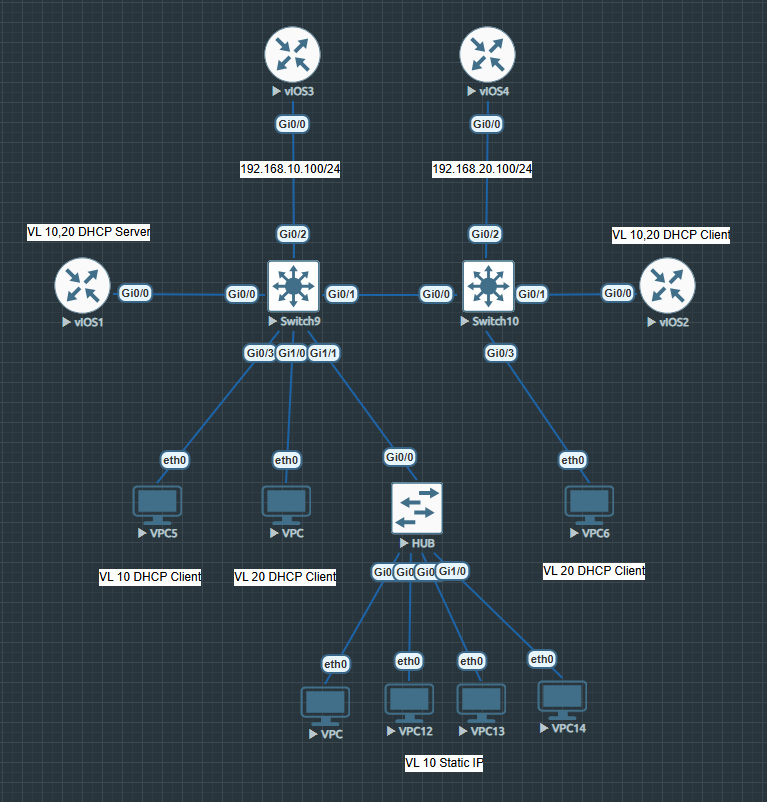

## DHCP Snooping + DAI (dynamic arp inspection)+ IP source Guard + Port-Security



### [SW9 full config](configs/SW9.md)
### [SW10 full config](configs/SW10.md)
### [R1 full config](configs/R1.md)
### [R2 full config](configs/R2.md)
### [R3 full config](configs/R3.md)
### [R4 full config](configs/R4.md)
### [HUB full config](configs/HUB.md)

### DHCP Snooping

#### SW9

<details>
    <summary>sh run</summary>

    hostname SW9
    !
    ip dhcp snooping vlan 10,20
    no ip dhcp snooping information option
    ip dhcp snooping
    !
    interface GigabitEthernet0/0
    description *** to DHCP Server ***
    switchport trunk allowed vlan 10,20
    switchport trunk encapsulation dot1q
    switchport mode trunk
    negotiation auto
    ip dhcp snooping trust
    !
    end
</details>


#### SW10

<details>
    <summary>sh run</summary>
    
    hostname SW10
    !
    ip dhcp snooping vlan 10,20
    no ip dhcp snooping information option
    ip dhcp snooping
    !
    interface GigabitEthernet0/0
    description *** to DHCP Server ***
    switchport trunk allowed vlan 10,20
    switchport trunk encapsulation dot1q
    switchport mode trunk
    negotiation auto
    ip dhcp snooping trust
    !
    end
  
</details>

**Для начала включаем глобально, прописываем для каких vlan это будет актуально.
После этого все порты становятся не доверенными, это значит то что ни с одного из них не будут приниматься Offer. Настраиваем порт, который смотрит в сторону легитимного DHCP сервера, как trust. Это значиит, что только с этого порта будут приниматься DHCP OFFER.**

#### DHCP Snooping Binding
#### SW9

<details>
    <summary>sh ip dhcp snooping binding</summary>
    
    SW9#sh ip dhcp snooping binding
    MacAddress          IpAddress        Lease(sec)  Type           VLAN  Interface
    ------------------  ---------------  ----------  -------------  ----  --------------------
    00:50:79:66:68:07   192.168.20.4     86366       dhcp-snooping   20   GigabitEthernet1/0
    50:00:00:02:00:00   192.168.10.7     70724       dhcp-snooping   10    GigabitEthernet0/1
    50:00:00:02:00:00   192.168.20.5     70769       dhcp-snooping   20    GigabitEthernet0/1
    00:50:79:66:68:05   192.168.10.4     86347       dhcp-snooping   10    GigabitEthernet0/3
    00:50:79:66:68:06   192.168.20.2     64407       dhcp-snooping   20    GigabitEthernet0/1
    Total number of bindings: 5

</details>

#### SW10

<details>
    <summary>sh ip dhcp snooping binding</summary>
    
    SW10#sh ip dhcp snooping binding
    MacAddress          IpAddress        Lease(sec)  Type           VLAN  Interface
    ------------------  ---------------  ----------  -------------  ----  --------------------
    50:00:00:02:00:00   192.168.10.7     70948       dhcp-snooping   10    GigabitEthernet0/1
    50:00:00:02:00:00   192.168.20.5     70993       dhcp-snooping   20    GigabitEthernet0/1
    00:50:79:66:68:06   192.168.20.2     64633       dhcp-snooping   20    GigabitEthernet0/3
  
</details>

### Dynamic ARP Inspection

#### SW9

<details>
    <summary>sh run</summary>
    
    hostname SW9
    !
    ip arp inspection vlan 10,20
    !
    interface GigabitEthernet0/0
    description *** to DHCP Server ***
    switchport trunk allowed vlan 10,20
    switchport trunk encapsulation dot1q
    switchport mode trunk
    ip arp inspection trust
    negotiation auto
    ip dhcp snooping trust
    !
    interface GigabitEthernet0/1
    description *** to SW10 ***
    switchport trunk allowed vlan 10,20
    switchport trunk encapsulation dot1q
    switchport mode trunk
    ip arp inspection trust
    negotiation auto
    !
    interface GigabitEthernet0/2
    description *** to Static Server ***
    switchport access vlan 10
    switchport mode access
    ip arp inspection trust
    negotiation auto
    !
    end
  
</details>


#### SW10

<details>
    <summary>sh run</summary>
    
    hostname SW10
    !
    ip arp inspection vlan 10,20
    !
    interface GigabitEthernet0/0
    description *** to DHCP Server ***
    switchport trunk allowed vlan 10,20
    switchport trunk encapsulation dot1q
    switchport mode trunk
    ip arp inspection trust
    negotiation auto
    ip dhcp snooping trust
    !
    interface GigabitEthernet0/2
    description *** to Static Server ***
    switchport access vlan 20
    switchport mode access
    ip arp inspection trust
    negotiation auto
    !
    end
  
</details>


**Для начала прописываем для каких vlan это будет актуально.
После включения все порты становятся не доверенными.
DAI работает совместно с DHCP snooping, т.е. опирается на базу.
И здесь три варианта, если есть порты, за которыми что-то настроено статикой, то можно статически добавить эту запись в базу DHCP Snooping и получить связанность между теми кто получил адрес по DHCP и у кого статика. Либо создать mac access list и прописать разрешенные маки. Либо просто сконфигурировать порт, за которым статика, как доверенный это менее секьюрно, но более удобно.**


```
Пример команды для статической записи, вводится из global mode
SW10#ip dhcp snooping binding 5000.0004.0000 vlan 20 192.168.20.100 interface gi0/2 expiry 4294967295
```


**Если следующим шагом планируется настрока IPSG, то лучше настроить порт как trust, потому что пр настройке IPSG нужно будет вносить эту связку MAC+IP+VLAN в базу IPSG и будет конфликт.**


### IP Source Guard

#### SW9

<details>
    <summary>sh run</summary>
    
    hostname SW9
    !
    ip device tracking
    !
    interface GigabitEthernet0/2
    description *** to Static Server ***
    switchport access vlan 10
    switchport mode access
    ip device tracking maximum 8
    ip arp inspection trust
    negotiation auto
    ip verify source tracking
    !
    ip source binding 5000.0003.0000 vlan 10 192.168.10.100 interface Gi0/2
    !
    end
  
</details>


#### SW10

<details>
    <summary>sh run</summary>
    
    hostname SW10
    !
    ip device tracking
    !
    interface GigabitEthernet0/2
    description *** to Static Server ***
    switchport access vlan 20
    switchport mode access
    ip device tracking maximum 8
    ip arp inspection trust
    negotiation auto
    ip verify source tracking
    !
    ip source binding 5000.0004.0000 vlan 20 192.168.20.100 interface Gi0/2
    !
    end
  
</details>

#### SW9 Source Table

<details>
    <summary>sh ip verify source</summary>
    
    SW9#sh ip verify source
    Interface  Filter-type  Filter-mode  IP-address       Mac-address        Vlan
    ---------  -----------  -----------  ---------------  -----------------  ----
    Gi0/2      ip trk       active       192.168.10.100                      10
       
</details>

<details>
    <summary>sh ip source binding</summary>
    
    SW9#sh ip source binding
    MacAddress          IpAddress        Lease(sec)  Type           VLAN  Interface
    ------------------  ---------------  ----------  -------------  ----  --------------------
    00:50:79:66:68:07   192.168.20.4     81362       dhcp-snooping   20    GigabitEthernet1/0
    50:00:00:02:00:00   192.168.10.7     65720       dhcp-snooping   10    GigabitEthernet0/1
    50:00:00:03:00:00   192.168.10.100   infinite    static          10    GigabitEthernet0/2
    50:00:00:02:00:00   192.168.20.5     65765       dhcp-snooping   20    GigabitEthernet0/1
    00:50:79:66:68:05   192.168.10.4     81343       dhcp-snooping   10    GigabitEthernet0/3
    00:50:79:66:68:06   192.168.20.2     83574       dhcp-snooping   20    GigabitEthernet0/1
    Total number of bindings: 6
  
</details>

<details>
    <summary>sh ip device tracking all</summary>
    
    SW9#sh ip device tracking all
    Global IP Device Tracking for clients = Enabled
    Global IP Device Tracking Probe Count = 3
    Global IP Device Tracking Probe Interval = 30
    Global IP Device Tracking Probe Delay Interval = 0
    -----------------------------------------------------------------------------------------------
    IP Address    MAC Address   Vlan  Interface           Probe-Timeout      State    Source
    -----------------------------------------------------------------------------------------------
    192.168.10.100  5000.0003.0000 10   GigabitEthernet0/2     30              ACTIVE   ARP

    Total number interfaces enabled: 1
    Enabled interfaces:
      Gi0/2
  
</details>


#### SW10 Source Table

<details>
    <summary>sh ip verify source</summary>
    
    SW10#sh ip verify source
    Interface  Filter-type  Filter-mode  IP-address       Mac-address        Vlan
    ---------  -----------  -----------  ---------------  -----------------  ----
    Gi0/2      ip trk       active       192.168.20.100                      20
  
</details>

<details>
    <summary>sh ip source binding</summary>
    
    SW10#sh ip source binding
    MacAddress          IpAddress        Lease(sec)  Type           VLAN  Interface
    ------------------  ---------------  ----------  -------------  ----  --------------------
    50:00:00:02:00:00   192.168.10.7     65311       dhcp-snooping   10    GigabitEthernet0/1
    50:00:00:02:00:00   192.168.20.5     65356       dhcp-snooping   20    GigabitEthernet0/1
    50:00:00:04:00:00   192.168.20.100   infinite    static          20    GigabitEthernet0/2
    00:50:79:66:68:06   192.168.20.2     83160       dhcp-snooping   20    GigabitEthernet0/3
    Total number of bindings: 4

</details>

<details>
    <summary>sh ip device tracking all</summary>
    
    SW10#sh ip device tracking all
    Global IP Device Tracking for clients = Enabled
    Global IP Device Tracking Probe Count = 3
    Global IP Device Tracking Probe Interval = 30
    Global IP Device Tracking Probe Delay Interval = 0
    -----------------------------------------------------------------------------------------------
    IP Address    MAC Address   Vlan  Interface           Probe-Timeout      State    Source
    -----------------------------------------------------------------------------------------------
    192.168.20.100  5000.0004.0000 20   GigabitEthernet0/2     30              ACTIVE   ARP

    Total number interfaces enabled: 1
    Enabled interfaces:
      Gi0/2
  
</details>


Рекомендации по настройке IPSG от [CISCO](https://www.cisco.com/en/US/docs/switches/lan/catalyst3850/software/release/3.2_0_se/multibook/configuration_guide/b_consolidated_config_guide_3850_chapter_0110110.html)


#### Static IP source binding can only be configured on switch port

```
If IP source guard is enabled and you enable or disable DHCP snooping on a VLAN on the trunk interface, the switch might not properly filter traffic.
```

```
SUMMARY STEPS
1.    configure terminal  
2.    ip device tracking  
3.    interface interface-id  
4.    switchport mode access  
5.    switchport access vlan vlan-id  
6.    ip verify source[tracking] [mac-check ]  

Enables IP source guard with source IP address filtering.
(Optional) tracking—Enables IP source guard for static hosts.
(Optional) mac-check—Enables MAC address filtering.
The command ip verify source tracking mac-check enables IP source guard for static hosts with MAC address filtering.

7.    ip device tracking maximum number  

Establishes a maximum limit for the number of static IPs that the IP device tracking table allows on the port. The range is 1 to 10. The maximum number is 10.

You must configure the ip device tracking maximum limit-number interface configuration command.

8.    end
```

#### IP Source Guard for Static Hosts

```
IPSG for static hosts extends the IPSG capability to non-DHCP and static environments. The previous IPSG used the entries created by DHCP snooping to validate the hosts connected to a switch. Any traffic received from a host without a valid DHCP binding entry is dropped. This security feature restricts IP traffic on nonrouted Layer 2 interfaces. It filters traffic based on the DHCP snooping binding database and on manually configured IP source bindings. The previous version of IPSG required a DHCP environment for IPSG to work.

IPSG for static hosts allows IPSG to work without DHCP. IPSG for static hosts relies on IP device tracking-table entries to install port ACLs. The switch creates static entries based on ARP requests or other IP packets to maintain the list of valid hosts for a given port. You can also specify the number of hosts allowed to send traffic to a given port. This is equivalent to port security at Layer 3.

IPSG for static hosts also supports dynamic hosts. If a dynamic host receives a DHCP-assigned IP address that is available in the IP DHCP snooping table, the same entry is learned by the IP device tracking table. In a stacked environment, when the master failover occurs, the IP source guard entries for static hosts attached to member ports are retained. When you enter the show ip device tracking all EXEC command, the IP device tracking table displays the entries as ACTIVE
```
```
Для начала нужно глобально включить ip device tracking, а после настроить параметры на интерфейсе, который смотрит в сторону статических хостов
```


```
В приведенном примере, осуществляется проверка только IP, но можно сконфигурировать и проверку связки MAC+IP
```