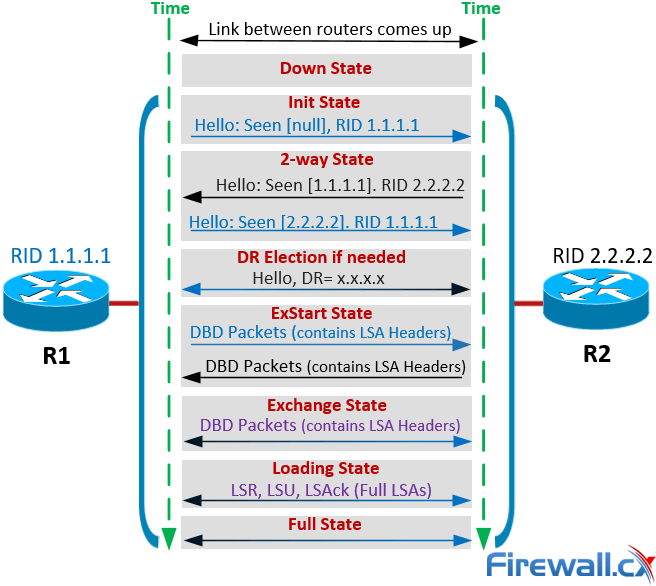
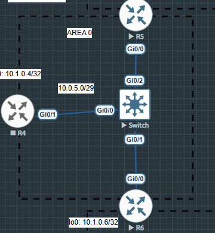
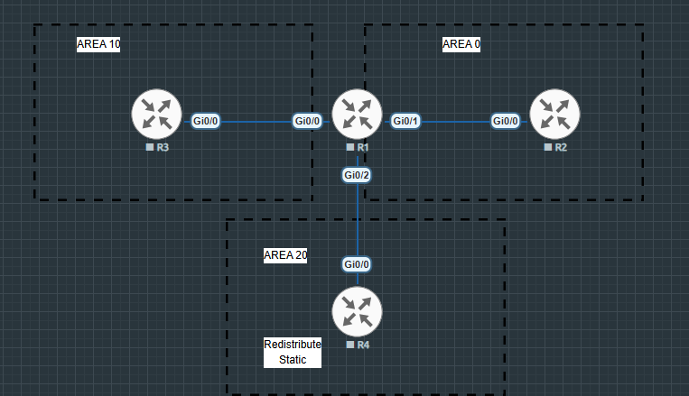
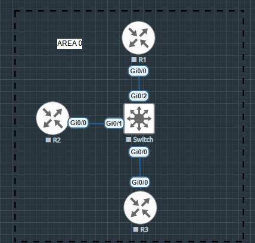
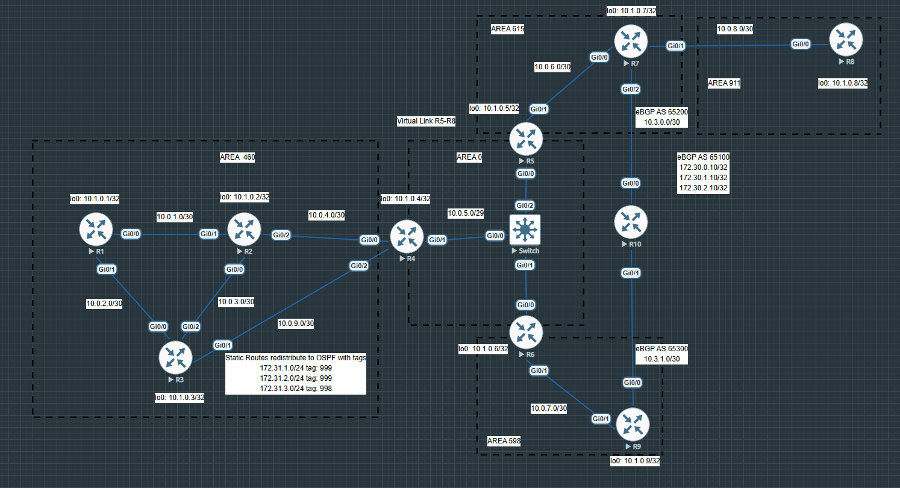
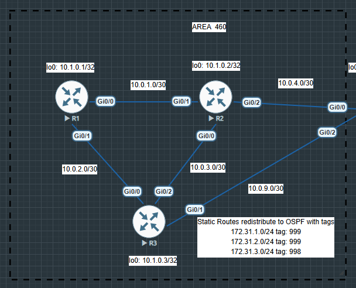

## Open Shortest Path First

```
Link State протокол
```

```
OSPFv2 - работает поверх IPv4, обменивается только IPv4 маршрутами. Протокол номер 89
```

```
Передает Hello пакеты на Mcast address 224.0.0.5 и 224.0.0.6 (DR)
```

```
OSPFv3 - рабоает только поверх IPv6,обменивается саршрутами IPv4 и IPv6
```

```
Router ID (RID) должен быть уникальным, можно задавать вручную или автоматически по самому маленькому IP адресу. Но CISCO берет самый большой IP адрес loopback
```

```
MTU - важно, чтобы на соседях были одинаковые MTU иначе один не сможет прочесть LSDB другого, т.к. она просто не вместится без фрагментации. Но этим поведением можно управлять, настраивается на интерфейсе в сторону соседа
```

```
R3(config-if)#ip ospf mtu-ignore
```

```
Если нужно отказаться от рассыли Hello сообщений на всех, то нужно указать конкретного соседа. Т.е. не будет флуда на 224.0.0.5
```

```
R3(config-router)#neighbor 1.1.1.1
```
### Состояние соседства

```
Hello Protocol

INIT - принимаются hello без указания нас, как соседа

2WAY - принимаются hello с указанием нас как соседа
```

```
Database Exchange

EXSTART - согласование sequence number, выбор Master

EXCHANGE - обмен database description

LOADING - обмен пакетами Link State Request и Link State Update 

FULL - LSDB синхронизированны
```

```
Все LSDB на всех роутерах должны быть синхронны (одинаковы)
```

```
При EXCHANGE обмениваются своими DBD
При LOADING обмениваются недостоющими sequence number
```



### LSA OSPFv2

```
Type 1 - Router LSA - коннектед сети, все ифейсы, где поднят OSPF
```

```
Type 2 - Network LSA - Генерит DR для общего канала, внутри информация о том, с какими маршрутизаторами было построено соседство и какие префиксы используются
```

```
Type 1 и Type 2 распространяются внутри региона
```

```
Если общий канал не нужен, т.е. тип сети point-to-point, то LSA Type 2 не генерируются, т.к. нет смысла выбирать кто будет DR, а кто BDR. И тем самым сходимость происходит быстрее.
```

```
Type 3 - Summary LSA - генерирует ABR и приносит информацию о сетях из других регионов
```

```
Type 4 - Summary ABR - ABR транслирует в регион информацию об известных ASBR, а именно:
ASBR RID
Суммарную стоимость пути от ABR до ASBR

Каждый ABR генерирует по одной LSA type 4 на каждый известный ASBR
```

```
Type 5 - External ASBR - внешние маршруты, которые пришли через редистрибуцию из других протоколов маршрутизации
```

```
Type 7 - NSSA External - внешние маршруты, которые пришли через редистрибуцию из других протоколов маршрутизации в NSSA зоне
```
### Designated Router (DR)

```
Придуман для решения проблемы в Multiaccess средах
```



```
R4#sh ip ospf neighbor

Neighbor ID     Pri   State           Dead Time   Address         Interface
10.1.0.5          1   FULL/BDR        00:00:36    10.0.5.2        GigabitEthernet0/1
10.1.0.6          1   FULL/DR         00:00:32    10.0.5.3        GigabitEthernet0/1
10.1.0.3          0   FULL/  -        00:00:36    10.0.9.1        GigabitEthernet0/2
10.1.0.2          0   FULL/  -        00:00:31    10.0.4.2        GigabitEthernet0/0
```

```
Чтобы не строить связи каждый с каждым, достаточно сделать так чтобы роутеры "думали", что у них p2p линк и тогда алгоритм просчитает все связи и сойдется
```

```
Т.е. здесь R4 является DR
```

```
Это некая оптимизация, в канале выбирается DR, по схеме Priority + RID без преемптинга.
```

```
DR синхронизирует LSDB со всеми роутерами в канале
```

```
DROTHER между собой остаются в 2WAY
```

```
Если есть связь с DR, то есть связь и со всеми остальными
```

```
Для отказоустойчивости выбирают Backup DR (BDR)
```
### OSPF Best Path Selection
#### Предпочтения маршрутов по RFC 2328

```
LSA 1 - Intra-Area маршруты
LSA 3 - Intera-Area маршруты
LSA 5 type 1 - External маршруты с учетом транзита (метрики) по сети
LSA 5 type 2 - External маршруты без учетом транзита (метрики) по сети
LSA 4 - ASBR Summary

O > IA > E1 > E2 > N1 > N2

N1 - N2 - Для NSSA зоны, где может происходить трансляция LSA Type 7 -> Type 5.
N1 - c учетом транзита
N2 - без учета
```

## Типы зон

```
STUB - тупиковая, в этой зоне не распространяются LSA type 5 (удаляются и заменяются на default), соответственно не сработает редистрибуция 
```

```
Если использкется stub no-summary, в stub зону приедет только default, если просто stub, то приедет как default, так и specific routes
```

```
NSSA - не совсем тупиковая, похожа на stub, но только возможна редиcтрибуция. В этой зоне генерятся LSA type 7. Возможны трюки s forwarding address
```

```
Если в LSDB присутсвует FA, то ищем префикс за FA, если FA: 0.0.0.0, то ищем префикс за Advertising Router
```

```
Это применяется к NSSA, т.е. когда LSA type 7 транслируется в type 5, то можно указать suppres-fa, что приведет к FA: 0.0.0.0, а можно не указывать и тогда нужно будет смотреть в FA 
```
### Суммаризация межзонных маршрутов

```
Делается на ABR (роутер, который стоит на границе зон, т.е. одной ногой смотрит в area 0, другой в area 10)
```

```
R6(config-router)#area 0 range 10.0.0.0 255.255.0.0 ?
  advertise      Advertise this range (default)
  cost           User specified metric for this range
  not-advertise  DoNotAdvertise this range
  <cr>           <cr>
```

```
Если advertise, то просто просуммируются в GRT
Eckb not-adbertise, то исчезнут из GRT, т.е. получим фильтрацию
```

```
Суммаризацию LSA можно делать на том роутере, который её породил
```

### Суммаризация внешних маршрутов



```
Предположим, что в AREA 20 есть редистрибуция статических маршрутов, с точки зрения OSPF это внешние маршруты (LSA type 5). Поскольку суммаризация LSA проводится на том роутере, который её породил, то делаем summary-address на R4.
```

```
Эта суммарная LSA будет жить до тех пор, пока сохраняется хотябы одинмаршрут, который попадает под эту сумму.
```
### Фильтрация межзонных маршрутов (LSA type 3)

```
Делается на ABR через prefix-list
```

```
R6(config-router)#area 598 filter-list prefix PL ?
  in   Filter networks sent to this area
  out  Filter networks sent from this area

in  - для маршрутов, которые приходят в эту зону
out - для маршрутов, которые выходят из этой зоны
```

```
ip prefix-list PL_TEST seq 5 permit 1.2.3.0/24 - матчится точное соответствие, т.е. только 1.2.3.0/24 и ни как иначе

ip prefix-list PL_TEST seq 10 permit 1.2.3.0/24 le 32 - матчатся все сети из дипазона 24 - 32, т.е. все более мелкие в одной /24 

ip prefix-list PL_TEST seq 15 deny 1.1.1.0/24 ge 26 - матчатся все сети из диапазона 26 - 32

ip prefix-list PL_TEST seq 20 deny 0.0.0.0/0 le 32 - матчатся абсолютно все сети

ip prefix-list PL_TEST seq 25 deny 0.0.0.0/0 ge 32 - не матчатся ничего

ip prefix-list PL_TEST seq 30 deny any any - неявное правило
```

### Фильтрация внутри региона

```
Делается либо на конкретного соседа, либо на всех
```



```
Предположим, что R1 никому не должен передавать маршруты, то заходим на интерфейс, через который построенно соседство и говорим database-filter all out
```

```
R1(config-if)#ip ospf database-filter all out
```

```
Если нужно, чтобы маршруты не видел только R3, а на R2 они приходили, то прописываем на конкретного соседа
```

```
R1(config-router)#neighbor 10.1.0.4 database-filter all out
```
### Debug LSDB


#### LSDB

```
R4#sh ip ospf database

            OSPF Router with ID (10.1.0.4) (Process ID 1)

                Router Link States (Area 0)

Link ID         ADV Router      Age         Seq#       Checksum Link count
10.1.0.4        10.1.0.4        550         0x8000000A 0x008C3C 2
10.1.0.5        10.1.0.5        368         0x80000013 0x001571 3
10.1.0.6        10.1.0.6        433         0x80000011 0x00A613 2
10.1.0.7        10.1.0.7        2     (DNA) 0x80000003 0x0007DE 1

                Net Link States (Area 0)

Link ID         ADV Router      Age         Seq#       Checksum
10.0.5.3        10.1.0.6        433         0x8000000C 0x004797

                Summary Net Link States (Area 0)

Link ID         ADV Router      Age         Seq#       Checksum
10.0.1.0        10.1.0.4        550         0x80000009 0x009B7C
10.0.2.0        10.1.0.4        550         0x80000008 0x009285
10.0.3.0        10.1.0.4        550         0x80000008 0x005FBB
10.0.4.0        10.1.0.4        813         0x80000008 0x004AD0
10.0.6.0        10.1.0.5        1121        0x8000000B 0x0028EC
10.0.6.0        10.1.0.7        2     (DNA) 0x80000001 0x0030EC
10.0.7.0        10.1.0.6        1442        0x8000000B 0x0017FB
10.0.8.0        10.1.0.7        2     (DNA) 0x80000001 0x001A01
10.0.9.0        10.1.0.4        813         0x80000008 0x001303
10.1.0.1        10.1.0.4        550         0x80000008 0x00AE65
10.1.0.2        10.1.0.4        550         0x80000009 0x0070A6
10.1.0.3        10.1.0.4        550         0x80000008 0x0068AE
10.1.0.7        10.1.0.5        1121        0x8000000B 0x0034DA
10.1.0.7        10.1.0.7        2     (DNA) 0x80000001 0x0032E5
10.1.0.8        10.1.0.7        2     (DNA) 0x80000001 0x0032E3
10.1.0.9        10.1.0.6        1442        0x8000000B 0x001AF1

                Summary ASB Link States (Area 0)

Link ID         ADV Router      Age         Seq#       Checksum
10.1.0.3        10.1.0.4        550         0x80000008 0x0050C6
10.1.0.7        10.1.0.5        1121        0x8000000B 0x001CF2
10.1.0.9        10.1.0.6        1442        0x8000000B 0x00020A

                Router Link States (Area 460)

Link ID         ADV Router      Age         Seq#       Checksum Link count
10.1.0.1        10.1.0.1        1153        0x8000000D 0x00610B 5
10.1.0.2        10.1.0.2        335         0x8000000E 0x001211 7
10.1.0.3        10.1.0.3        443         0x8000000F 0x00D43F 7
10.1.0.4        10.1.0.4        550         0x8000000A 0x00A5DA 4

                Summary Net Link States (Area 460)

Link ID         ADV Router      Age         Seq#       Checksum
10.0.5.0        10.1.0.4        550         0x8000000A 0x0023F8
10.0.6.0        10.1.0.4        550         0x80000008 0x003ED9
10.0.7.0        10.1.0.4        550         0x80000008 0x0033E3
10.0.8.0        10.1.0.4        550         0x80000008 0x0032E2
10.1.0.4        10.1.0.4        550         0x80000008 0x0054C2
10.1.0.5        10.1.0.4        550         0x80000008 0x0054C0
10.1.0.6        10.1.0.4        550         0x80000008 0x004AC9
10.1.0.7        10.1.0.4        550         0x80000008 0x004AC7
10.1.0.8        10.1.0.4        550         0x80000008 0x004AC5
10.1.0.9        10.1.0.4        550         0x80000008 0x0036D9

                Summary ASB Link States (Area 460)

Link ID         ADV Router      Age         Seq#       Checksum
10.1.0.7        10.1.0.4        550         0x80000008 0x0032DF
10.1.0.9        10.1.0.4        550         0x80000008 0x001EF1

                Type-5 AS External Link States

Link ID         ADV Router      Age         Seq#       Checksum Tag
0.0.0.0         10.1.0.7        1218        0x8000000B 0x009AFB 1
0.0.0.0         10.1.0.9        1456        0x8000000B 0x008E06 1
172.30.0.10     10.1.0.7        1218        0x8000000B 0x004235 65100
172.30.0.10     10.1.0.9        1456        0x8000000B 0x00363F 65100
172.30.1.10     10.1.0.7        1218        0x8000000B 0x00373F 65100
172.30.1.10     10.1.0.9        1456        0x8000000B 0x002B49 65100
172.30.2.10     10.1.0.7        1218        0x8000000B 0x002C49 65100
172.30.2.10     10.1.0.9        1456        0x8000000B 0x002053 65100
172.31.1.0      10.1.0.3        1198        0x8000000B 0x001839 999
172.31.1.0      10.1.0.7        449         0x80000008 0x0095EC 65100
172.31.2.0      10.1.0.3        1198        0x8000000B 0x000D43 999
172.31.2.0      10.1.0.7        449         0x80000008 0x008AF6 65100
172.31.3.0      10.1.0.3        1198        0x8000000B 0x00EF60 998

```

#### Router LSA

```
В случае LSA type 1 значения Link ID и ADV Router одинаковы и не содержится информации о маске на интерфейсе
```

```
R4#sh ip ospf database router 10.1.0.4

            OSPF Router with ID (10.1.0.4) (Process ID 1)

                Router Link States (Area 0)

  LS age: 505
  Options: (No TOS-capability, DC)
  LS Type: Router Links
  Link State ID: 10.1.0.4
  Advertising Router: 10.1.0.4
  LS Seq Number: 8000000A
  Checksum: 0x8C3C
  Length: 48
  Area Border Router
  Number of Links: 2 - кол-во линков которые анонсируются в текущую Area

    Link connected to: a Stub Network
     (Link ID) Network/subnet number: 10.1.0.4 - LOOPBACK
     (Link Data) Network Mask: 255.255.255.255
      Number of MTID metrics: 0
       TOS 0 Metrics: 1

    Link connected to: a Transit Network
     (Link ID) Designated Router address: 10.0.5.3
     (Link Data) Router Interface address: 10.0.5.1 - ИФЕЙС, которым смотрим в Area 0
      Number of MTID metrics: 0
       TOS 0 Metrics: 1

```

```
R4#sh ip ospf database router 10.1.0.5

            OSPF Router with ID (10.1.0.4) (Process ID 1)

                Router Link States (Area 0)

  LS age: 742
  Options: (No TOS-capability, DC)
  LS Type: Router Links
  Link State ID: 10.1.0.5
  Advertising Router: 10.1.0.5
  LS Seq Number: 80000013
  Checksum: 0x1571
  Length: 60
  Area Border Router
  Number of Links: 3

    Link connected to: a Virtual Link
     (Link ID) Neighboring Router ID: 10.1.0.7
     (Link Data) Router Interface address: 10.0.6.1
      Number of MTID metrics: 0
       TOS 0 Metrics: 1

    Link connected to: a Stub Network
     (Link ID) Network/subnet number: 10.1.0.5 - LOOPBACK
     (Link Data) Network Mask: 255.255.255.255
      Number of MTID metrics: 0
       TOS 0 Metrics: 1

    Link connected to: a Transit Network
     (Link ID) Designated Router address: 10.0.5.3
     (Link Data) Router Interface address: 10.0.5.2 - ИФЕЙС, которым смотрим в Area 0
      Number of MTID metrics: 0
       TOS 0 Metrics: 1

```

```
R4#sh ip ospf database router 10.1.0.6

            OSPF Router with ID (10.1.0.4) (Process ID 1)

                Router Link States (Area 0)

  LS age: 961
  Options: (No TOS-capability, DC)
  LS Type: Router Links
  Link State ID: 10.1.0.6
  Advertising Router: 10.1.0.6
  LS Seq Number: 80000011
  Checksum: 0xA613
  Length: 48
  Area Border Router
  Number of Links: 2

    Link connected to: a Stub Network
     (Link ID) Network/subnet number: 10.1.0.6 - LOOPBACK
     (Link Data) Network Mask: 255.255.255.255
      Number of MTID metrics: 0
       TOS 0 Metrics: 1

    Link connected to: a Transit Network
     (Link ID) Designated Router address: 10.0.5.3
     (Link Data) Router Interface address: 10.0.5.3 - ИФЕЙС, которым смотрим в Area 0
      Number of MTID metrics: 0
       TOS 0 Metrics: 1

```

```
Из этих выводов видно, что все видят Designated Router address: 10.0.5.3 со своих интерфейсов. Подключено через общий сегмент
```
#### Network LSA (генерит DR)

```
LSA type 2 генерятся только при типе сети BROADCAST
```

```
R4#sh ip ospf interface Gi0/1
GigabitEthernet0/1 is up, line protocol is up
  Internet Address 10.0.5.1/29, Area 0, Attached via Interface Enable
  Process ID 1, Router ID 10.1.0.4, Network Type BROADCAST, Cost: 1
  Topology-MTID    Cost    Disabled    Shutdown      Topology Name
        0           1         no          no            Base
  Enabled by interface config, including secondary ip addresses
  Transmit Delay is 1 sec, State DROTHER, Priority 1
  Designated Router (ID) 10.1.0.6, Interface address 10.0.5.3
  Backup Designated router (ID) 10.1.0.5, Interface address 10.0.5.2
  Timer intervals configured, Hello 10, Dead 40, Wait 40, Retransmit 5
    oob-resync timeout 40
    Hello due in 00:00:08
  Supports Link-local Signaling (LLS)
  Cisco NSF helper support enabled
  IETF NSF helper support enabled
  Index 1/2/3, flood queue length 0
  Next 0x0(0)/0x0(0)/0x0(0)
  Last flood scan length is 0, maximum is 8
  Last flood scan time is 0 msec, maximum is 1 msec
  Neighbor Count is 2, Adjacent neighbor count is 2
    Adjacent with neighbor 10.1.0.5  (Backup Designated Router)
    Adjacent with neighbor 10.1.0.6  (Designated Router)
  Suppress hello for 0 neighbor(s)
```

```
R4#sh ip ospf database network adv-router 10.1.0.6

            OSPF Router with ID (10.1.0.4) (Process ID 1)

                Net Link States (Area 0)

  LS age: 1504
  Options: (No TOS-capability, DC)
  LS Type: Network Links
  Link State ID: 10.0.5.3 (address of Designated Router)
  Advertising Router: 10.1.0.6
  LS Seq Number: 8000000C
  Checksum: 0x4797
  Length: 36
  Network Mask: /29
        Attached Router: 10.1.0.6
        Attached Router: 10.1.0.4
        Attached Router: 10.1.0.5

```

```
Из вывода видно, что это DR c RID 10.1.0.6, у которого есть интерфейс 10.0.5.3 с маской /29, к которому подключены три роутера, один из которых он сам.
```

```
Т.е. есть ифейс с адресом 10.0.5.3/29 с которго видны ещё два роутера со своими RID
```

```
но это не наш роутер, т.к. у R4

R4#sh ip ospf interface  b
Interface    PID   Area            IP Address/Mask    Cost  State Nbrs F/C
Lo0          1     0               10.1.0.4/32        1     LOOP  0/0
Gi0/1        1     0               10.0.5.1/29        1     DROTH 2/2
Gi0/2        1     460             10.0.9.2/30        1     P2P   1/1
Gi0/0        1     460             10.0.4.1/30        1     P2P   1/1
```

```
Что видим на R6
```

```
R6#sh ip ospf database network adv-router 10.1.0.6

            OSPF Router with ID (10.1.0.6) (Process ID 1)

                Net Link States (Area 0)

  LS age: 1990
  Options: (No TOS-capability, DC)
  LS Type: Network Links
  Link State ID: 10.0.5.3 (address of Designated Router)
  Advertising Router: 10.1.0.6
  LS Seq Number: 8000000C
  Checksum: 0x4797
  Length: 36
  Network Mask: /29
        Attached Router: 10.1.0.6
        Attached Router: 10.1.0.4
        Attached Router: 10.1.0.5
```

```
Если тип сети POINT-TO-POINT, то LSA type 2 не генерятся
```

```
R1#sh ip ospf int Gi0/1
GigabitEthernet0/1 is up, line protocol is up
  Internet Address 10.0.2.1/30, Area 460, Attached via Interface Enable
  Process ID 1, Router ID 10.1.0.1, Network Type POINT_TO_POINT, Cost: 5
  Topology-MTID    Cost    Disabled    Shutdown      Topology Name
        0           5         no          no            Base
  Enabled by interface config, including secondary ip addresses
  Transmit Delay is 1 sec, State POINT_TO_POINT, BFD enabled
  Timer intervals configured, Hello 10, Dead 40, Wait 40, Retransmit 5
    oob-resync timeout 40
    Hello due in 00:00:06
  Supports Link-local Signaling (LLS)
  Cisco NSF helper support enabled
  IETF NSF helper support enabled
  Index 1/3/3, flood queue length 0
  Next 0x0(0)/0x0(0)/0x0(0)
  Last flood scan length is 1, maximum is 13
  Last flood scan time is 0 msec, maximum is 3 msec
  Neighbor Count is 1, Adjacent neighbor count is 1
    Adjacent with neighbor 10.1.0.3
  Suppress hello for 0 neighbor(s)
  Cryptographic authentication enabled
    Youngest key id is 10
```

```
Уже нет LSA type 2
```

```
R1#sh ip ospf database

            OSPF Router with ID (10.1.0.1) (Process ID 1)

                Router Link States (Area 460)

Link ID         ADV Router      Age         Seq#       Checksum Link count
10.1.0.1        10.1.0.1        1482        0x8000000E 0x005F0C 5
10.1.0.2        10.1.0.2        682         0x8000000F 0x001012 7
10.1.0.3        10.1.0.3        812         0x80000010 0x00D240 7
10.1.0.4        10.1.0.4        1102        0x8000000B 0x00A3DB 4

                Summary Net Link States (Area 460)

Link ID         ADV Router      Age         Seq#       Checksum
10.0.5.0        10.1.0.4        1102        0x8000000B 0x0021F9
10.0.6.0        10.1.0.4        1102        0x80000009 0x003CDA
10.0.7.0        10.1.0.4        1102        0x80000009 0x0031E4
10.0.8.0        10.1.0.4        1102        0x80000009 0x0030E3
10.1.0.4        10.1.0.4        1102        0x80000009 0x0052C3
10.1.0.5        10.1.0.4        1102        0x80000009 0x0052C1
10.1.0.6        10.1.0.4        1102        0x80000009 0x0048CA
10.1.0.7        10.1.0.4        1102        0x80000009 0x0048C8
10.1.0.8        10.1.0.4        1102        0x80000009 0x0048C6
10.1.0.9        10.1.0.4        1102        0x80000009 0x0034DA

                Summary ASB Link States (Area 460)

Link ID         ADV Router      Age         Seq#       Checksum
10.1.0.7        10.1.0.4        1102        0x80000009 0x0030E0
10.1.0.9        10.1.0.4        1102        0x80000009 0x001CF2

                Type-5 AS External Link States

Link ID         ADV Router      Age         Seq#       Checksum Tag
0.0.0.0         10.1.0.7        1547        0x8000000C 0x0098FC 1
0.0.0.0         10.1.0.9        1838        0x8000000C 0x008C07 1
172.30.0.10     10.1.0.7        1547        0x8000000C 0x004036 65100
172.30.0.10     10.1.0.9        1838        0x8000000C 0x003440 65100
172.30.1.10     10.1.0.7        1547        0x8000000C 0x003540 65100
172.30.1.10     10.1.0.9        1838        0x8000000C 0x00294A 65100
172.30.2.10     10.1.0.7        1547        0x8000000C 0x002A4A 65100
172.30.2.10     10.1.0.9        1838        0x8000000C 0x001E54 65100
172.31.1.0      10.1.0.3        1564        0x8000000C 0x00163A 999
172.31.1.0      10.1.0.7        785         0x80000009 0x0093ED 65100
172.31.2.0      10.1.0.3        1564        0x8000000C 0x000B44 999
172.31.2.0      10.1.0.7        785         0x80000009 0x0088F7 65100
172.31.3.0      10.1.0.3        1564        0x8000000C 0x00ED61 998
```

### Traffic Engineering

```
Направлением движения можно управлять с помощью cost, считается на выходе относительно роутера.
```



#### R1

```
interface GigabitEthernet0/0
 ip address 10.0.1.1 255.255.255.252
 ip ospf authentication
 ip ospf authentication-key OSPF_KEY
 ip ospf network point-to-point
 ip ospf 1 area 460
 ip ospf cost 5
 duplex auto
 speed auto
 media-type rj45
 bfd interval 100 min_rx 100 multiplier 3
end
```

```
interface GigabitEthernet0/1
 ip address 10.0.2.1 255.255.255.252
 ip ospf authentication message-digest
 ip ospf message-digest-key 10 md5 KEY_R1R3
 ip ospf network point-to-point
 ip ospf 1 area 460
 ip ospf cost 5
 duplex auto
 speed auto
 media-type rj45
 bfd interval 100 min_rx 100 multiplier 3
end
```

```
R1#sh ip ro 10.1.0.2
Routing entry for 10.1.0.2/32
  Known via "ospf 1", distance 110, metric 6, type intra area
  Last update from 10.0.1.2 on GigabitEthernet0/0, 06:44:13 ago
  Routing Descriptor Blocks:
  * 10.0.1.2, from 10.1.0.2, 06:44:13 ago, via GigabitEthernet0/0
      Route metric is 6, traffic share count is 1
```

```
Теперь изменим cost на R1
```

```
R1(config-if)#ip ospf cost 10
```

```
interface GigabitEthernet0/0
 ip address 10.0.1.1 255.255.255.252
 ip ospf authentication
 ip ospf authentication-key OSPF_KEY
 ip ospf network point-to-point
 ip ospf 1 area 460
 ip ospf cost 10
 duplex auto
 speed auto
 media-type rj45
 bfd interval 100 min_rx 100 multiplier 3
end
```

```
R1#sh ip ro 10.1.0.2
Routing entry for 10.1.0.2/32
  Known via "ospf 1", distance 110, metric 7, type intra area
  Last update from 10.0.2.2 on GigabitEthernet0/1, 00:00:29 ago
  Routing Descriptor Blocks:
  * 10.0.2.2, from 10.1.0.2, 00:00:29 ago, via GigabitEthernet0/1
      Route metric is 7, traffic share count is 1
```

```
И уже видно, что дешевле добраться через Gi0/1
```

```
В свою очередь R2 видит 10.1.0.1 за Gi0/1
```

```
R2#sh ip ro 10.1.0.1
Routing entry for 10.1.0.1/32
  Known via "ospf 1", distance 110, metric 6, type intra area
  Last update from 10.0.1.1 on GigabitEthernet0/1, 06:49:39 ago
  Routing Descriptor Blocks:
  * 10.0.1.1, from 10.1.0.1, 06:49:39 ago, via GigabitEthernet0/1
      Route metric is 6, traffic share count is 1
```
#### R2

```
interface GigabitEthernet0/1
 ip address 10.0.1.2 255.255.255.252
 ip ospf authentication
 ip ospf authentication-key OSPF_KEY
 ip ospf network point-to-point
 ip ospf 1 area 460
 ip ospf cost 5
 duplex auto
 speed auto
 media-type rj45
 bfd interval 100 min_rx 100 multiplier 3
end
```

```
interface GigabitEthernet0/0
 ip address 10.0.3.2 255.255.255.252
 ip ospf authentication key-chain OSPF_KEYCHAIN
 ip ospf network point-to-point
 ip ospf 1 area 460
 duplex auto
 speed auto
 media-type rj45
 bfd interval 100 min_rx 100 multiplier 3
end
```
#### R3

```
interface GigabitEthernet0/0
 ip address 10.0.2.2 255.255.255.252
 ip ospf authentication message-digest
 ip ospf message-digest-key 10 md5 KEY_R1R3
 ip ospf network point-to-point
 ip ospf 1 area 460
 ip ospf cost 5
 duplex auto
 speed auto
 media-type rj45
 bfd interval 100 min_rx 100 multiplier 3
end
```

```
interface GigabitEthernet0/2
 ip address 10.0.3.1 255.255.255.252
 ip ospf authentication key-chain OSPF_KEYCHAIN
 ip ospf network point-to-point
 ip ospf 1 area 460
 duplex auto
 speed auto
 media-type rj45
 bfd interval 100 min_rx 100 multiplier 3
end
```


