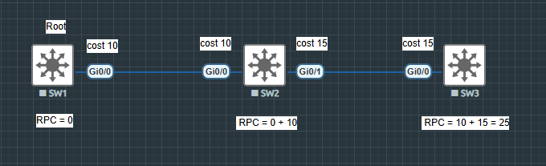
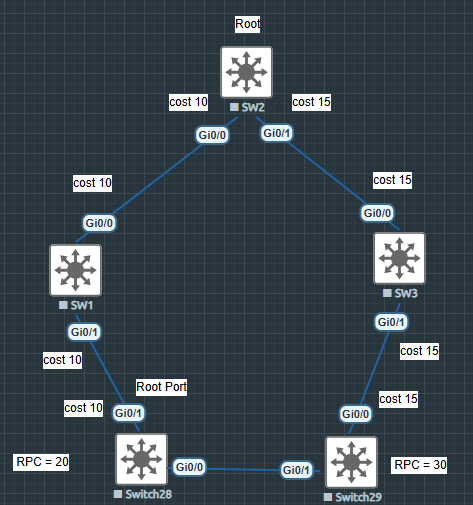
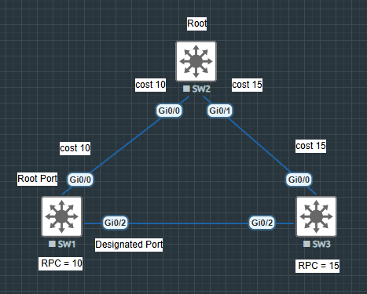
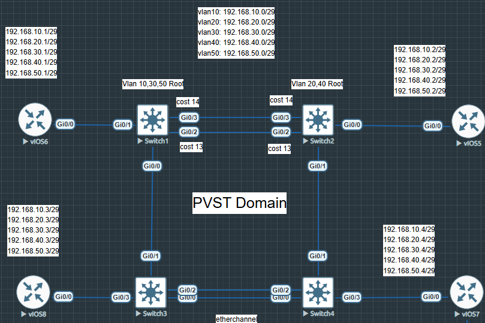
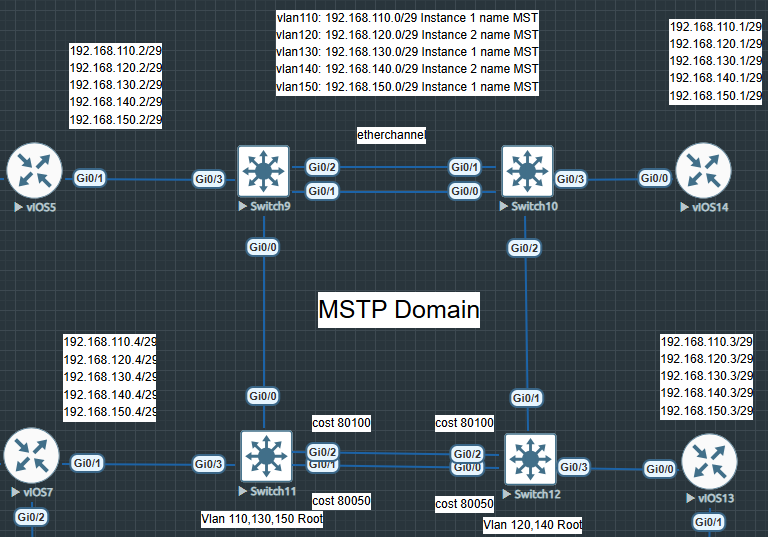
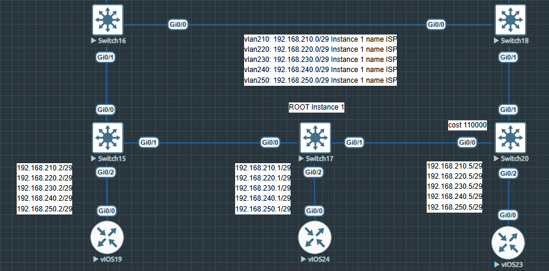

## BPDU

```
Состоит из Bridge ID; Sender Bridge ID; Root Bridge ID
```

```
При выборе root - коммутатора сравнивается Bridge ID и чем меньньше, тем больше шансов стать root
```

```
Bridge ID состоит из:
- Bridge Priority (0 - 61440 c шагом 4096) default value 32768
- System ID Extension (0 - 4095) по сути это номер VLAN
- MAC Address
```

### Root Path Cost

```
Root Path Cost - стоимость до корневого коммутатора считается на входе,
нужен для определения root-порта
```

```
У root - коммутатора RPC = 0
```





```
Cost можно навешивать как на интерфейс так и на vlan, делается из настроек интерфейса
```

```
Если RPC одинаковый, то для выбора root порта используются след. парамметры:
- Lowest Sender ID
- Lowest Sender Port ID (port priority) (чем меньше, тем больше шансов стать root портом)
```
### Alternate Port (запасной корневой порт)

```
BPDU на alternate port хуже (inferior) по сравнению с BPDU на корневом порту.
Но она лучше (superior) той, которую в порт могли бы отправить 
```

```
Alternate Port остается заблокированным после пересчета топологии
```

```
Таких портов может быть несколько
```

### Designated Port (выделенный порт)

```
Порт, на котором отправляемая BPDU оказывается выгоднее по сравнению с теми, которые мы получили
```

```
Через это порт передаются данные
```



```
SW1 отправляет в сторону SW2 BPDU
```

```
SW2 в сторону SW1 уже не отправляет, а только принимает от него
```

### Backup Port (запасной порт)

```
Принимается Superior BPDU, у которй Sender Bridge ID c нашим
```

```
Коммутатор в сегмент смотрит в сегмент более чем одним портом, один из которых выбран designated, а остальные backup
```

```
Остается заблокированным после пересчета топологии
```

### Examples



```
Задача пустить трафик не по крадчайшему пути
```

```
SW1 Root для VLAN 10,30,50
SW2 Root для VLAN 20,40
```

#### SW1

``` 
hostname SW1
!
spanning-tree mode pvst
spanning-tree extend system-id
spanning-tree vlan 10,30,50 priority 0
spanning-tree vlan 20,40 priority 4096
!
interface GigabitEthernet0/0
 switchport trunk allowed vlan 10,20,30,40,50
 switchport trunk encapsulation dot1q
 switchport mode trunk
 media-type rj45
 negotiation auto
!
interface GigabitEthernet0/1
 switchport trunk allowed vlan 10,20,30,40,50
 switchport trunk encapsulation dot1q
 switchport mode trunk
 media-type rj45
 negotiation auto
 spanning-tree portfast edge trunk
!
interface GigabitEthernet0/2
 switchport trunk allowed vlan 10,20,30,40,50
 switchport trunk encapsulation dot1q
 switchport mode trunk
 media-type rj45
 negotiation auto
 spanning-tree cost 13
!
interface GigabitEthernet0/3
 switchport trunk allowed vlan 10,20,30,40,50
 switchport trunk encapsulation dot1q
 switchport mode trunk
 media-type rj45
 negotiation auto
 spanning-tree cost 14
!
end
```

#### SW2

```
hostname SW2
!
spanning-tree mode pvst
spanning-tree extend system-id
spanning-tree vlan 10,30,50 priority 4096
spanning-tree vlan 20,40 priority 0
!
interface GigabitEthernet0/0
 switchport trunk allowed vlan 10,20,30,40,50
 switchport trunk encapsulation dot1q
 switchport mode trunk
 media-type rj45
 negotiation auto
 spanning-tree portfast edge trunk
!
interface GigabitEthernet0/1
 switchport trunk allowed vlan 10,20,30,40,50
 switchport trunk encapsulation dot1q
 switchport mode trunk
 media-type rj45
 negotiation auto
!
interface GigabitEthernet0/2
 switchport trunk allowed vlan 10,20,30,40,50
 switchport trunk encapsulation dot1q
 switchport mode trunk
 media-type rj45
 negotiation auto
 spanning-tree cost 13
!
interface GigabitEthernet0/3
 switchport trunk allowed vlan 10,20,30,40,50
 switchport trunk encapsulation dot1q
 switchport mode trunk
 media-type rj45
 negotiation auto
 spanning-tree cost 14
!
end
```

#### SW3

```
hostname SW3
!
spanning-tree mode pvst
!
interface Port-channel1
 switchport trunk allowed vlan 10,20,30,40,50
 switchport trunk encapsulation dot1q
 switchport mode trunk
!
interface GigabitEthernet0/0
 switchport trunk allowed vlan 10,20,30,40,50
 switchport trunk encapsulation dot1q
 switchport mode trunk
 media-type rj45
 negotiation auto
 channel-group 1 mode active
!
interface GigabitEthernet0/1
 switchport trunk allowed vlan 10,20,30,40,50
 switchport trunk encapsulation dot1q
 switchport mode trunk
 media-type rj45
 negotiation auto
!
interface GigabitEthernet0/2
 switchport trunk allowed vlan 10,20,30,40,50
 switchport trunk encapsulation dot1q
 switchport mode trunk
 media-type rj45
 negotiation auto
 channel-group 1 mode active
!
interface GigabitEthernet0/3
 switchport trunk allowed vlan 10,20,30,40,50
 switchport trunk encapsulation dot1q
 switchport mode trunk
 media-type rj45
 negotiation auto
 spanning-tree portfast edge trunk
 !
 end
```

#### SW4

```
hostname SW4
!
spanning-tree mode pvst
!
interface Port-channel1
 switchport trunk allowed vlan 10,20,30,40,50
 switchport trunk encapsulation dot1q
 switchport mode trunk
!
interface GigabitEthernet0/0
 switchport trunk allowed vlan 10,20,30,40,50
 switchport trunk encapsulation dot1q
 switchport mode trunk
 media-type rj45
 negotiation auto
 channel-group 1 mode active
!
interface GigabitEthernet0/1
 switchport trunk allowed vlan 10,20,30,40,50
 switchport trunk encapsulation dot1q
 switchport mode trunk
 media-type rj45
 negotiation auto
!
interface GigabitEthernet0/2
 switchport trunk allowed vlan 10,20,30,40,50
 switchport trunk encapsulation dot1q
 switchport mode trunk
 media-type rj45
 negotiation auto
 channel-group 1 mode active
!
interface GigabitEthernet0/3
 switchport trunk allowed vlan 10,20,30,40,50
 switchport trunk encapsulation dot1q
 switchport mode trunk
 media-type rj45
 negotiation auto
 spanning-tree portfast edge trunk
!
end
```

```
SW1#sh spanning-tree vlan 10

VLAN0010
  Spanning tree enabled protocol ieee
  Root ID    Priority    10
             Address     5001.0001.0000
             This bridge is the root
             Hello Time   2 sec  Max Age 20 sec  Forward Delay 15 sec

  Bridge ID  Priority    10     (priority 0 sys-id-ext 10)
             Address     5001.0001.0000
             Hello Time   2 sec  Max Age 20 sec  Forward Delay 15 sec
             Aging Time  300 sec

Interface           Role Sts Cost      Prio.Nbr Type
------------------- ---- --- --------- -------- --------------------------------
Gi0/0               Desg FWD 4         128.1    P2p
Gi0/1               Desg FWD 4         128.2    P2p Edge
Gi0/2               Desg FWD 13        128.3    P2p
Gi0/3               Desg FWD 14        128.4    P2p
```

```
SW1#sh spanning-tree vlan 20

VLAN0020
  Spanning tree enabled protocol ieee
  Root ID    Priority    20
             Address     5001.0002.0000
             Cost        11
             Port        1 (GigabitEthernet0/0)
             Hello Time   2 sec  Max Age 20 sec  Forward Delay 15 sec

  Bridge ID  Priority    4116   (priority 4096 sys-id-ext 20)
             Address     5001.0001.0000
             Hello Time   2 sec  Max Age 20 sec  Forward Delay 15 sec
             Aging Time  300 sec

Interface           Role Sts Cost      Prio.Nbr Type
------------------- ---- --- --------- -------- --------------------------------
Gi0/0               Root FWD 4         128.1    P2p
Gi0/1               Desg FWD 4         128.2    P2p Edge
Gi0/2               Altn BLK 13        128.3    P2p
Gi0/3               Altn BLK 14        128.4    P2p
```

```
Для VLAN 10,30,50 - это root, согласно выставленному приоритету, соответсвенно все его порты за эти vlan будут designated
```

```
Для VLAN 20,40 - root - SW2, согласно выставленному приоритету и согласно расставленных cost добираться до root дешевле через интерфейс gi0/0
```

```
Поскольку cost считается на входе, то для VLAN 10 root это SW1 и на интерфейсах SW2
gi0/2 и gi0/3 выставлен высокий cost. Для того чтобы "стоимость" BPDU, которая придет от SW1 была больше (RPC SW1 = 0 -> SW2 cost 13 RPC = 13), чем та, которая пойдет другим путем (SW1 -> SW3 -> SW4 -> SW2 RPC = 11), тем самым мы задаем направление движения трафика, т.е. это некий Traffic Engeneering для L2
```

```
SW2#sh spanning-tree vlan 10

VLAN0010
  Spanning tree enabled protocol ieee
  Root ID    Priority    10
             Address     5001.0001.0000
             Cost        11
             Port        2 (GigabitEthernet0/1)
             Hello Time   2 sec  Max Age 20 sec  Forward Delay 15 sec

  Bridge ID  Priority    4106   (priority 4096 sys-id-ext 10)
             Address     5001.0002.0000
             Hello Time   2 sec  Max Age 20 sec  Forward Delay 15 sec
             Aging Time  300 sec

Interface           Role Sts Cost      Prio.Nbr Type
------------------- ---- --- --------- -------- --------------------------------
Gi0/0               Desg FWD 4         128.1    P2p Edge
Gi0/1               Root FWD 4         128.2    P2p
Gi0/2               Altn BLK 13        128.3    P2p
Gi0/3               Altn BLK 14        128.4    P2p
```

```
SW2#sh spanning-tree vlan 20

VLAN0020
  Spanning tree enabled protocol ieee
  Root ID    Priority    20
             Address     5001.0002.0000
             This bridge is the root
             Hello Time   2 sec  Max Age 20 sec  Forward Delay 15 sec

  Bridge ID  Priority    20     (priority 0 sys-id-ext 20)
             Address     5001.0002.0000
             Hello Time   2 sec  Max Age 20 sec  Forward Delay 15 sec
             Aging Time  300 sec

Interface           Role Sts Cost      Prio.Nbr Type
------------------- ---- --- --------- -------- --------------------------------
Gi0/0               Desg FWD 4         128.1    P2p Edge
Gi0/1               Desg FWD 4         128.2    P2p
Gi0/2               Desg FWD 13        128.3    P2p
Gi0/3               Desg FWD 14        128.4    P2p
```

```
SW3#sh spanning-tree vlan 10

VLAN0010
  Spanning tree enabled protocol ieee
  Root ID    Priority    10
             Address     5001.0001.0000
             Cost        4
             Port        2 (GigabitEthernet0/1)
             Hello Time   2 sec  Max Age 20 sec  Forward Delay 15 sec

  Bridge ID  Priority    32778  (priority 32768 sys-id-ext 10)
             Address     5001.0003.0000
             Hello Time   2 sec  Max Age 20 sec  Forward Delay 15 sec
             Aging Time  300 sec

Interface           Role Sts Cost      Prio.Nbr Type
------------------- ---- --- --------- -------- --------------------------------
Gi0/1               Root FWD 4         128.2    P2p
Gi0/3               Desg FWD 4         128.4    P2p Edge
Po1                 Desg FWD 3         128.65   P2p
```

```
На SW3 для VLAN 10 до root дешевле добраться через gi0/1 
```

```
SW3#sh spanning-tree vlan 20

VLAN0020
  Spanning tree enabled protocol ieee
  Root ID    Priority    20
             Address     5001.0002.0000
             Cost        7
             Port        65 (Port-channel1)
             Hello Time   2 sec  Max Age 20 sec  Forward Delay 15 sec

  Bridge ID  Priority    32788  (priority 32768 sys-id-ext 20)
             Address     5001.0003.0000
             Hello Time   2 sec  Max Age 20 sec  Forward Delay 15 sec
             Aging Time  300 sec

Interface           Role Sts Cost      Prio.Nbr Type
------------------- ---- --- --------- -------- --------------------------------
Gi0/1               Desg FWD 4         128.2    P2p
Gi0/3               Desg FWD 4         128.4    P2p Edge
Po1                 Root FWD 3         128.65   P2p
```

```
На SW3 для VLAN 20 до root дешевле добраться через po1
```

```
SW4#sh spanning-tree vlan 10

VLAN0010
  Spanning tree enabled protocol ieee
  Root ID    Priority    10
             Address     5001.0001.0000
             Cost        7
             Port        65 (Port-channel1)
             Hello Time   2 sec  Max Age 20 sec  Forward Delay 15 sec

  Bridge ID  Priority    32778  (priority 32768 sys-id-ext 10)
             Address     5001.0004.0000
             Hello Time   2 sec  Max Age 20 sec  Forward Delay 15 sec
             Aging Time  300 sec

Interface           Role Sts Cost      Prio.Nbr Type
------------------- ---- --- --------- -------- --------------------------------
Gi0/1               Desg FWD 4         128.2    P2p
Gi0/3               Desg FWD 4         128.4    P2p Edge
Po1                 Root FWD 3         128.65   P2p
```

```
На SW4 для VLAN 10 до root дешевле добраться через po1, т.к. root для VLAN 10 это SW1 
```

```
SW4#sh spanning-tree vlan 20

VLAN0020
  Spanning tree enabled protocol ieee
  Root ID    Priority    20
             Address     5001.0002.0000
             Cost        4
             Port        2 (GigabitEthernet0/1)
             Hello Time   2 sec  Max Age 20 sec  Forward Delay 15 sec

  Bridge ID  Priority    32788  (priority 32768 sys-id-ext 20)
             Address     5001.0004.0000
             Hello Time   2 sec  Max Age 20 sec  Forward Delay 15 sec
             Aging Time  300 sec

Interface           Role Sts Cost      Prio.Nbr Type
------------------- ---- --- --------- -------- --------------------------------
Gi0/1               Root FWD 4         128.2    P2p
Gi0/3               Desg FWD 4         128.4    P2p Edge
Po1                 Desg FWD 3         128.65   P2p
```

```
На SW4 для VLAN 20 до root дешевле добраться через gi0/1, т.к. root для VLAN 20 это SW2
```
#### Разорвем линк между SW1 и SW3

```
SW1#sh ip int b
Interface              IP-Address      OK? Method Status                Protocol
GigabitEthernet0/0     unassigned      YES unset  administratively down down
GigabitEthernet0/1     unassigned      YES unset  up                    up
GigabitEthernet0/2     unassigned      YES unset  up                    up
GigabitEthernet0/3     unassigned      YES unset  up                    up
```

```
SW1#sh spanning-tree vlan 10

VLAN0010
  Spanning tree enabled protocol ieee
  Root ID    Priority    10
             Address     5001.0001.0000
             This bridge is the root
             Hello Time   2 sec  Max Age 20 sec  Forward Delay 15 sec

  Bridge ID  Priority    10     (priority 0 sys-id-ext 10)
             Address     5001.0001.0000
             Hello Time   2 sec  Max Age 20 sec  Forward Delay 15 sec
             Aging Time  300 sec

Interface           Role Sts Cost      Prio.Nbr Type
------------------- ---- --- --------- -------- --------------------------------
Gi0/1               Desg FWD 4         128.2    P2p Edge
Gi0/2               Desg FWD 13        128.3    P2p
Gi0/3               Desg FWD 14        128.4    P2p
```

```
SW1#sh spanning-tree vlan 20

VLAN0020
  Spanning tree enabled protocol ieee
  Root ID    Priority    20
             Address     5001.0002.0000
             Cost        13
             Port        3 (GigabitEthernet0/2)
             Hello Time   2 sec  Max Age 20 sec  Forward Delay 15 sec

  Bridge ID  Priority    4116   (priority 4096 sys-id-ext 20)
             Address     5001.0001.0000
             Hello Time   2 sec  Max Age 20 sec  Forward Delay 15 sec
             Aging Time  300 sec

Interface           Role Sts Cost      Prio.Nbr Type
------------------- ---- --- --------- -------- --------------------------------
Gi0/1               Desg FWD 4         128.2    P2p Edge
Gi0/2               Root FWD 13        128.3    P2p
Gi0/3               Altn BLK 14        128.4    P2p
```

```
SW2#sh spanning-tree vlan 10

VLAN0010
  Spanning tree enabled protocol ieee
  Root ID    Priority    10
             Address     5001.0001.0000
             Cost        13
             Port        3 (GigabitEthernet0/2)
             Hello Time   2 sec  Max Age 20 sec  Forward Delay 15 sec

  Bridge ID  Priority    4106   (priority 4096 sys-id-ext 10)
             Address     5001.0002.0000
             Hello Time   2 sec  Max Age 20 sec  Forward Delay 15 sec
             Aging Time  300 sec

Interface           Role Sts Cost      Prio.Nbr Type
------------------- ---- --- --------- -------- --------------------------------
Gi0/0               Desg FWD 4         128.1    P2p Edge
Gi0/1               Desg FWD 4         128.2    P2p
Gi0/2               Root FWD 13        128.3    P2p
Gi0/3               Altn BLK 14        128.4    P2p
```

```
SW2#sh spanning-tree vlan 20

VLAN0020
  Spanning tree enabled protocol ieee
  Root ID    Priority    20
             Address     5001.0002.0000
             This bridge is the root
             Hello Time   2 sec  Max Age 20 sec  Forward Delay 15 sec

  Bridge ID  Priority    20     (priority 0 sys-id-ext 20)
             Address     5001.0002.0000
             Hello Time   2 sec  Max Age 20 sec  Forward Delay 15 sec
             Aging Time  300 sec

Interface           Role Sts Cost      Prio.Nbr Type
------------------- ---- --- --------- -------- --------------------------------
Gi0/0               Desg FWD 4         128.1    P2p Edge
Gi0/1               Desg FWD 4         128.2    P2p
Gi0/2               Desg FWD 13        128.3    P2p
Gi0/3               Desg FWD 14        128.4    P2p
```

```
SW3#sh spanning-tree vlan 10

VLAN0010
  Spanning tree enabled protocol ieee
  Root ID    Priority    10
             Address     5001.0001.0000
             Cost        20
             Port        65 (Port-channel1)
             Hello Time   2 sec  Max Age 20 sec  Forward Delay 15 sec

  Bridge ID  Priority    32778  (priority 32768 sys-id-ext 10)
             Address     5001.0003.0000
             Hello Time   2 sec  Max Age 20 sec  Forward Delay 15 sec
             Aging Time  300 sec

Interface           Role Sts Cost      Prio.Nbr Type
------------------- ---- --- --------- -------- --------------------------------
Gi0/1               Desg FWD 4         128.2    P2p
Gi0/3               Desg FWD 4         128.4    P2p Edge
Po1                 Root FWD 3         128.65   P2p
```

```
SW3#sh spanning-tree vlan 20

VLAN0020
  Spanning tree enabled protocol ieee
  Root ID    Priority    20
             Address     5001.0002.0000
             Cost        7
             Port        65 (Port-channel1)
             Hello Time   2 sec  Max Age 20 sec  Forward Delay 15 sec

  Bridge ID  Priority    32788  (priority 32768 sys-id-ext 20)
             Address     5001.0003.0000
             Hello Time   2 sec  Max Age 20 sec  Forward Delay 15 sec
             Aging Time  300 sec

Interface           Role Sts Cost      Prio.Nbr Type
------------------- ---- --- --------- -------- --------------------------------
Gi0/1               Desg FWD 4         128.2    P2p
Gi0/3               Desg FWD 4         128.4    P2p Edge
Po1                 Root FWD 3         128.65   P2p
```

```
SW4#sh spanning-tree vlan 10

VLAN0010
  Spanning tree enabled protocol ieee
  Root ID    Priority    10
             Address     5001.0001.0000
             Cost        17
             Port        2 (GigabitEthernet0/1)
             Hello Time   2 sec  Max Age 20 sec  Forward Delay 15 sec

  Bridge ID  Priority    32778  (priority 32768 sys-id-ext 10)
             Address     5001.0004.0000
             Hello Time   2 sec  Max Age 20 sec  Forward Delay 15 sec
             Aging Time  300 sec

Interface           Role Sts Cost      Prio.Nbr Type
------------------- ---- --- --------- -------- --------------------------------
Gi0/1               Root FWD 4         128.2    P2p
Gi0/3               Desg FWD 4         128.4    P2p Edge
Po1                 Desg FWD 3         128.65   P2p
```

```
SW4#sh spanning-tree vlan 20

VLAN0020
  Spanning tree enabled protocol ieee
  Root ID    Priority    20
             Address     5001.0002.0000
             Cost        4
             Port        2 (GigabitEthernet0/1)
             Hello Time   2 sec  Max Age 20 sec  Forward Delay 15 sec

  Bridge ID  Priority    32788  (priority 32768 sys-id-ext 20)
             Address     5001.0004.0000
             Hello Time   2 sec  Max Age 20 sec  Forward Delay 15 sec
             Aging Time  300 sec

Interface           Role Sts Cost      Prio.Nbr Type
------------------- ---- --- --------- -------- --------------------------------
Gi0/1               Root FWD 4         128.2    P2p
Gi0/3               Desg FWD 4         128.4    P2p Edge
Po1                 Desg FWD 3         128.65   P2p
```

### Для MST все также, только vlan привязаны к instance и важно чтобы на всех коммутаторах совпадали номер instance, имя региона (конфигурации) и ревизия




```
SW11 Root для VLAN 110,130,150
SW12 Root для VLAN 120,140
```
#### SW11

```
hostname SW11
!
spanning-tree mode mst
!
spanning-tree mst configuration
 name MST
 instance 1 vlan 110, 130, 150
 instance 2 vlan 120, 140
!
spanning-tree mst 1 priority 0
spanning-tree mst 2 priority 4096
!
interface GigabitEthernet0/0
 switchport trunk allowed vlan 110,120,130,140,150
 switchport trunk encapsulation dot1q
 switchport mode trunk
 media-type rj45
 negotiation auto
!
interface GigabitEthernet0/1
 switchport trunk allowed vlan 110,120,130,140,150
 switchport trunk encapsulation dot1q
 switchport mode trunk
 media-type rj45
 negotiation auto
 spanning-tree cost 80050
!
interface GigabitEthernet0/2
 switchport trunk allowed vlan 110,120,130,140,150
 switchport trunk encapsulation dot1q
 switchport mode trunk
 media-type rj45
 negotiation auto
 spanning-tree cost 80100
!
interface GigabitEthernet0/3
 switchport trunk allowed vlan 110,120,130,140,150
 switchport trunk encapsulation dot1q
 switchport mode trunk
 media-type rj45
 negotiation auto
 spanning-tree portfast edge trunk
!
end
```
#### SW12

```
hostname SW12
!
spanning-tree mode mst
spanning-tree extend system-id
!
spanning-tree mst configuration
 name MST
 instance 1 vlan 110, 130, 150
 instance 2 vlan 120, 140
!
spanning-tree mst 1 priority 4096
spanning-tree mst 2 priority 0
!
interface GigabitEthernet0/0
 switchport trunk allowed vlan 110,120,130,140,150
 switchport trunk encapsulation dot1q
 switchport mode trunk
 media-type rj45
 negotiation auto
 spanning-tree cost 80050
!
interface GigabitEthernet0/1
 switchport trunk allowed vlan 110,120,130,140,150
 switchport trunk encapsulation dot1q
 switchport mode trunk
 media-type rj45
 negotiation auto
!
interface GigabitEthernet0/2
 switchport trunk allowed vlan 110,120,130,140,150
 switchport trunk encapsulation dot1q
 switchport mode trunk
 media-type rj45
 negotiation auto
 spanning-tree cost 80100
!
interface GigabitEthernet0/3
 switchport trunk allowed vlan 110,120,130,140,150
 switchport trunk encapsulation dot1q
 switchport mode trunk
 media-type rj45
 negotiation auto
 spanning-tree portfast edge trunk
!
end
```
#### SW9

```
hostname SW9
!
spanning-tree mode mst
spanning-tree extend system-id
!
spanning-tree mst configuration
 name MST
 instance 1 vlan 110, 130, 150
 instance 2 vlan 120, 140
!
interface Port-channel1
 switchport trunk allowed vlan 110,120,130,140,150
 switchport trunk encapsulation dot1q
 switchport mode trunk
!
interface GigabitEthernet0/0
 switchport trunk allowed vlan 110,120,130,140,150
 switchport trunk encapsulation dot1q
 switchport mode trunk
 media-type rj45
 negotiation auto
!
interface GigabitEthernet0/1
 switchport trunk allowed vlan 110,120,130,140,150
 switchport trunk encapsulation dot1q
 switchport mode trunk
 media-type rj45
 negotiation auto
 channel-group 1 mode active
!
interface GigabitEthernet0/2
 switchport trunk allowed vlan 110,120,130,140,150
 switchport trunk encapsulation dot1q
 switchport mode trunk
 media-type rj45
 negotiation auto
 channel-group 1 mode active
!
interface GigabitEthernet0/3
 switchport trunk allowed vlan 110,120,130,140,150
 switchport trunk encapsulation dot1q
 switchport mode trunk
 media-type rj45
 negotiation auto
 spanning-tree portfast edge trunk
!
end
```
#### SW10

```
hostname SW10
!
spanning-tree mode mst
spanning-tree extend system-id
!
spanning-tree mst configuration
 name MST
 instance 1 vlan 110, 130, 150
 instance 2 vlan 120, 140
!
interface Port-channel1
 switchport trunk allowed vlan 110,120,130,140,150
 switchport trunk encapsulation dot1q
 switchport mode trunk
!
interface GigabitEthernet0/0
 switchport trunk allowed vlan 110,120,130,140,150
 switchport trunk encapsulation dot1q
 switchport mode trunk
 media-type rj45
 negotiation auto
 channel-group 1 mode active
!
interface GigabitEthernet0/1
 switchport trunk allowed vlan 110,120,130,140,150
 switchport trunk encapsulation dot1q
 switchport mode trunk
 media-type rj45
 negotiation auto
 channel-group 1 mode active
!
interface GigabitEthernet0/2
 switchport trunk allowed vlan 110,120,130,140,150
 switchport trunk encapsulation dot1q
 switchport mode trunk
 media-type rj45
 negotiation auto
!
interface GigabitEthernet0/3
 switchport trunk allowed vlan 110,120,130,140,150
 switchport trunk encapsulation dot1q
 switchport mode trunk
 media-type rj45
 negotiation auto
 spanning-tree portfast edge trunk
!
end
```
#### Root Port Information

```
SW11#sh spanning-tree vlan 110

MST1
  Spanning tree enabled protocol mstp
  Root ID    Priority    1
             Address     5001.000b.0000
             This bridge is the root
             Hello Time   2 sec  Max Age 20 sec  Forward Delay 15 sec

  Bridge ID  Priority    1      (priority 0 sys-id-ext 1)
             Address     5001.000b.0000
             Hello Time   2 sec  Max Age 20 sec  Forward Delay 15 sec

Interface           Role Sts Cost      Prio.Nbr Type
------------------- ---- --- --------- -------- --------------------------------
Gi0/0               Desg FWD 20000     128.1    P2p
Gi0/1               Desg FWD 80050     128.2    P2p
Gi0/2               Desg FWD 80100     128.3    P2p
Gi0/3               Desg FWD 20000     128.4    P2p Edge
```

```
SW11#sh spanning-tree vlan 120

MST2
  Spanning tree enabled protocol mstp
  Root ID    Priority    2
             Address     5001.000c.0000
             Cost        50000
             Port        1 (GigabitEthernet0/0)
             Hello Time   2 sec  Max Age 20 sec  Forward Delay 15 sec

  Bridge ID  Priority    4098   (priority 4096 sys-id-ext 2)
             Address     5001.000b.0000
             Hello Time   2 sec  Max Age 20 sec  Forward Delay 15 sec

Interface           Role Sts Cost      Prio.Nbr Type
------------------- ---- --- --------- -------- --------------------------------
Gi0/0               Root FWD 20000     128.1    P2p
Gi0/1               Altn BLK 80050     128.2    P2p
Gi0/2               Altn BLK 80100     128.3    P2p
Gi0/3               Desg FWD 20000     128.4    P2p Edge
```

```
SW12#sh spanning-tree vlan 110

MST1
  Spanning tree enabled protocol mstp
  Root ID    Priority    1
             Address     5001.000b.0000
             Cost        50000
             Port        2 (GigabitEthernet0/1)
             Hello Time   2 sec  Max Age 20 sec  Forward Delay 15 sec

  Bridge ID  Priority    4097   (priority 4096 sys-id-ext 1)
             Address     5001.000c.0000
             Hello Time   2 sec  Max Age 20 sec  Forward Delay 15 sec

Interface           Role Sts Cost      Prio.Nbr Type
------------------- ---- --- --------- -------- --------------------------------
Gi0/0               Altn BLK 80050     128.1    P2p
Gi0/1               Root FWD 20000     128.2    P2p
Gi0/2               Altn BLK 80100     128.3    P2p
Gi0/3               Desg FWD 20000     128.4    P2p Edge
```

```
SW12#sh spanning-tree vlan 120

MST2
  Spanning tree enabled protocol mstp
  Root ID    Priority    2
             Address     5001.000c.0000
             This bridge is the root
             Hello Time   2 sec  Max Age 20 sec  Forward Delay 15 sec

  Bridge ID  Priority    2      (priority 0 sys-id-ext 2)
             Address     5001.000c.0000
             Hello Time   2 sec  Max Age 20 sec  Forward Delay 15 sec

Interface           Role Sts Cost      Prio.Nbr Type
------------------- ---- --- --------- -------- --------------------------------
Gi0/0               Desg FWD 80050     128.1    P2p
Gi0/1               Desg FWD 20000     128.2    P2p
Gi0/2               Desg FWD 80100     128.3    P2p
Gi0/3               Desg FWD 20000     128.4    P2p Edge
```

```
SW9#sh spanning-tree vlan 110

MST1
  Spanning tree enabled protocol mstp
  Root ID    Priority    1
             Address     5001.000b.0000
             Cost        20000
             Port        1 (GigabitEthernet0/0)
             Hello Time   2 sec  Max Age 20 sec  Forward Delay 15 sec

  Bridge ID  Priority    32769  (priority 32768 sys-id-ext 1)
             Address     5001.0009.0000
             Hello Time   2 sec  Max Age 20 sec  Forward Delay 15 sec

Interface           Role Sts Cost      Prio.Nbr Type
------------------- ---- --- --------- -------- --------------------------------
Gi0/0               Root FWD 20000     128.1    P2p
Gi0/3               Desg FWD 20000     128.4    P2p Edge
Po1                 Desg FWD 10000     128.65   P2p
```

```
SW9#sh spanning-tree vlan 120

MST2
  Spanning tree enabled protocol mstp
  Root ID    Priority    2
             Address     5001.000c.0000
             Cost        30000
             Port        65 (Port-channel1)
             Hello Time   2 sec  Max Age 20 sec  Forward Delay 15 sec

  Bridge ID  Priority    32770  (priority 32768 sys-id-ext 2)
             Address     5001.0009.0000
             Hello Time   2 sec  Max Age 20 sec  Forward Delay 15 sec

Interface           Role Sts Cost      Prio.Nbr Type
------------------- ---- --- --------- -------- --------------------------------
Gi0/0               Desg FWD 20000     128.1    P2p
Gi0/3               Desg FWD 20000     128.4    P2p Edge
Po1                 Root FWD 10000     128.65   P2p
```

```
SW10#sh spanning-tree vlan 110

MST1
  Spanning tree enabled protocol mstp
  Root ID    Priority    1
             Address     5001.000b.0000
             Cost        30000
             Port        65 (Port-channel1)
             Hello Time   2 sec  Max Age 20 sec  Forward Delay 15 sec

  Bridge ID  Priority    32769  (priority 32768 sys-id-ext 1)
             Address     5001.000a.0000
             Hello Time   2 sec  Max Age 20 sec  Forward Delay 15 sec

Interface           Role Sts Cost      Prio.Nbr Type
------------------- ---- --- --------- -------- --------------------------------
Gi0/2               Desg FWD 20000     128.3    P2p
Gi0/3               Desg FWD 20000     128.4    P2p Edge
Po1                 Root FWD 10000     128.65   P2p
```

```
SW10#sh spanning-tree vlan 120

MST2
  Spanning tree enabled protocol mstp
  Root ID    Priority    2
             Address     5001.000c.0000
             Cost        20000
             Port        3 (GigabitEthernet0/2)
             Hello Time   2 sec  Max Age 20 sec  Forward Delay 15 sec

  Bridge ID  Priority    32770  (priority 32768 sys-id-ext 2)
             Address     5001.000a.0000
             Hello Time   2 sec  Max Age 20 sec  Forward Delay 15 sec

Interface           Role Sts Cost      Prio.Nbr Type
------------------- ---- --- --------- -------- --------------------------------
Gi0/2               Root FWD 20000     128.3    P2p
Gi0/3               Desg FWD 20000     128.4    P2p Edge
Po1                 Desg FWD 10000     128.65   P2p
```

#### Кольцо из 5-и коммутаторов на MSTP с root по середине


#### SW17

```
hostname SW17
!
spanning-tree mode mst
!
spanning-tree mst configuration
 name ISP
 instance 1 vlan 210, 220, 230, 240, 250
!
spanning-tree mst 1 priority 0
!
interface GigabitEthernet0/0
 switchport trunk allowed vlan 210,220,230,240,250
 switchport trunk encapsulation dot1q
 switchport mode trunk
 media-type rj45
 negotiation auto
!
interface GigabitEthernet0/1
 switchport trunk allowed vlan 210,220,230,240,250
 switchport trunk encapsulation dot1q
 switchport mode trunk
 media-type rj45
 negotiation auto
!
interface GigabitEthernet0/2
 switchport trunk allowed vlan 210,220,230,240,250
 switchport trunk encapsulation dot1q
 switchport mode trunk
 media-type rj45
 negotiation auto
 spanning-tree portfast edge trunk
!
interface GigabitEthernet0/3
 switchport trunk allowed vlan 210,220,230,240,250
 switchport trunk encapsulation dot1q
 switchport mode trunk
 media-type rj45
 negotiation auto
!
end
```
#### SW15

```
hostname SW15
!
spanning-tree mode mst
!
spanning-tree mst configuration
 name ISP
 instance 1 vlan 210, 220, 230, 240, 250
!
interface GigabitEthernet0/0
 switchport trunk allowed vlan 210,220,230,240,250
 switchport trunk encapsulation dot1q
 switchport mode trunk
 media-type rj45
 negotiation auto
!
interface GigabitEthernet0/1
 switchport trunk allowed vlan 210,220,230,240,250
 switchport trunk encapsulation dot1q
 switchport mode trunk
 media-type rj45
 negotiation auto
!
interface GigabitEthernet0/2
 switchport trunk allowed vlan 210,220,230,240,250
 switchport trunk encapsulation dot1q
 switchport mode trunk
 media-type rj45
 negotiation auto
 spanning-tree portfast edge trunk
!
interface GigabitEthernet0/3
 switchport trunk allowed vlan 210,220,230,240,250
 switchport trunk encapsulation dot1q
 switchport mode trunk
 media-type rj45
 negotiation auto
!
end
```
#### SW20

```
hostname SW20
!
spanning-tree mode mst
!
spanning-tree mst configuration
 name ISP
 instance 1 vlan 210, 220, 230, 240, 250
!

interface GigabitEthernet0/0
 switchport trunk allowed vlan 210,220,230,240,250
 switchport trunk encapsulation dot1q
 switchport mode trunk
 media-type rj45
 negotiation auto
 spanning-tree cost 110000
!
interface GigabitEthernet0/1
 switchport trunk allowed vlan 210,220,230,240,250
 switchport trunk encapsulation dot1q
 switchport mode trunk
 media-type rj45
 negotiation auto
!
interface GigabitEthernet0/2
 switchport trunk allowed vlan 210,220,230,240,250
 switchport trunk encapsulation dot1q
 switchport mode trunk
 media-type rj45
 negotiation auto
 spanning-tree portfast edge trunk
!
interface GigabitEthernet0/3
 switchport trunk allowed vlan 210,220,230,240,250
 switchport trunk encapsulation dot1q
 switchport mode trunk
 media-type rj45
 negotiation auto
!
end
```
#### SW18

```
hostname SW18
!
spanning-tree mode mst
!
spanning-tree mst configuration
 name ISP
 instance 1 vlan 210, 220, 230, 240, 250
!
interface GigabitEthernet0/0
 switchport trunk allowed vlan 210,220,230,240,250
 switchport trunk encapsulation dot1q
 switchport mode trunk
 media-type rj45
 negotiation auto
!
interface GigabitEthernet0/1
 switchport trunk allowed vlan 210,220,230,240,250
 switchport trunk encapsulation dot1q
 switchport mode trunk
 media-type rj45
 negotiation auto
!
interface GigabitEthernet0/2
 switchport trunk allowed vlan 210,220,230,240,250
 switchport trunk encapsulation dot1q
 switchport mode trunk
 media-type rj45
 negotiation auto
 spanning-tree portfast edge trunk
!
interface GigabitEthernet0/3
 switchport trunk allowed vlan 210,220,230,240,250
 switchport trunk encapsulation dot1q
 switchport mode trunk
 media-type rj45
 negotiation auto
!
end
```
#### SW16

```
hostname SW16
!
spanning-tree mode mst
!
spanning-tree mst configuration
 name ISP
 instance 1 vlan 210, 220, 230, 240, 250
!
interface GigabitEthernet0/0
 switchport trunk allowed vlan 210,220,230,240,250
 switchport trunk encapsulation dot1q
 switchport mode trunk
 media-type rj45
 negotiation auto
!
interface GigabitEthernet0/1
 switchport trunk allowed vlan 210,220,230,240,250
 switchport trunk encapsulation dot1q
 switchport mode trunk
 media-type rj45
 negotiation auto
!
interface GigabitEthernet0/2
 switchport trunk allowed vlan 210,220,230,240,250
 switchport trunk encapsulation dot1q
 switchport mode trunk
 media-type rj45
 negotiation auto
!
interface GigabitEthernet0/3
 switchport trunk allowed vlan 210,220,230,240,250
 switchport trunk encapsulation dot1q
 switchport mode trunk
 media-type rj45
 negotiation auto
!
end
```
#### Root Port Information

```
SW17#sh spanning-tree vlan 210

MST1
  Spanning tree enabled protocol mstp
  Root ID    Priority    1
             Address     5001.0011.0000
             This bridge is the root
             Hello Time   2 sec  Max Age 20 sec  Forward Delay 15 sec

  Bridge ID  Priority    1      (priority 0 sys-id-ext 1)
             Address     5001.0011.0000
             Hello Time   2 sec  Max Age 20 sec  Forward Delay 15 sec

Interface           Role Sts Cost      Prio.Nbr Type
------------------- ---- --- --------- -------- --------------------------------
Gi0/0               Desg FWD 20000     128.1    P2p
Gi0/1               Desg FWD 20000     128.2    P2p
Gi0/2               Desg FWD 20000     128.3    P2p Edge
Gi0/3               Desg FWD 20000     128.4    P2p
```

```
R15#sh spanning-tree vlan 210

MST1
  Spanning tree enabled protocol mstp
  Root ID    Priority    1
             Address     5001.0011.0000
             Cost        20000
             Port        2 (GigabitEthernet0/1)
             Hello Time   2 sec  Max Age 20 sec  Forward Delay 15 sec

  Bridge ID  Priority    32769  (priority 32768 sys-id-ext 1)
             Address     5001.000f.0000
             Hello Time   2 sec  Max Age 20 sec  Forward Delay 15 sec

Interface           Role Sts Cost      Prio.Nbr Type
------------------- ---- --- --------- -------- --------------------------------
Gi0/0               Desg FWD 20000     128.1    P2p
Gi0/1               Root FWD 20000     128.2    P2p
Gi0/2               Desg FWD 20000     128.3    P2p Edge
Gi0/3               Desg FWD 20000     128.4    P2p
```

```
SW20#sh spanning-tree vlan 210

MST1
  Spanning tree enabled protocol mstp
  Root ID    Priority    1
             Address     5001.0011.0000
             Cost        80000
             Port        2 (GigabitEthernet0/1)
             Hello Time   2 sec  Max Age 20 sec  Forward Delay 15 sec

  Bridge ID  Priority    32769  (priority 32768 sys-id-ext 1)
             Address     5001.0014.0000
             Hello Time   2 sec  Max Age 20 sec  Forward Delay 15 sec

Interface           Role Sts Cost      Prio.Nbr Type
------------------- ---- --- --------- -------- --------------------------------
Gi0/0               Altn BLK 110000    128.1    P2p
Gi0/1               Root FWD 20000     128.2    P2p
Gi0/2               Desg FWD 20000     128.3    P2p Edge
Gi0/3               Desg FWD 20000     128.4    P2p
```

```
SW18#sh spanning-tree vlan 210

MST1
  Spanning tree enabled protocol mstp
  Root ID    Priority    1
             Address     5001.0011.0000
             Cost        60000
             Port        1 (GigabitEthernet0/0)
             Hello Time   2 sec  Max Age 20 sec  Forward Delay 15 sec

  Bridge ID  Priority    32769  (priority 32768 sys-id-ext 1)
             Address     5001.0012.0000
             Hello Time   2 sec  Max Age 20 sec  Forward Delay 15 sec

Interface           Role Sts Cost      Prio.Nbr Type
------------------- ---- --- --------- -------- --------------------------------
Gi0/0               Root FWD 20000     128.1    P2p
Gi0/1               Desg FWD 20000     128.2    P2p
Gi0/2               Desg FWD 20000     128.3    P2p Edge
Gi0/3               Desg FWD 20000     128.4    P2p
```

```
SW16#sh spanning-tree vlan 210

MST1
  Spanning tree enabled protocol mstp
  Root ID    Priority    1
             Address     5001.0011.0000
             Cost        40000
             Port        2 (GigabitEthernet0/1)
             Hello Time   2 sec  Max Age 20 sec  Forward Delay 15 sec

  Bridge ID  Priority    32769  (priority 32768 sys-id-ext 1)
             Address     5001.0010.0000
             Hello Time   2 sec  Max Age 20 sec  Forward Delay 15 sec

Interface           Role Sts Cost      Prio.Nbr Type
------------------- ---- --- --------- -------- --------------------------------
Gi0/0               Desg FWD 20000     128.1    P2p
Gi0/1               Root FWD 20000     128.2    P2p
Gi0/2               Desg FWD 20000     128.3    P2p
Gi0/3               Desg FWD 20000     128.4    P2p
```

