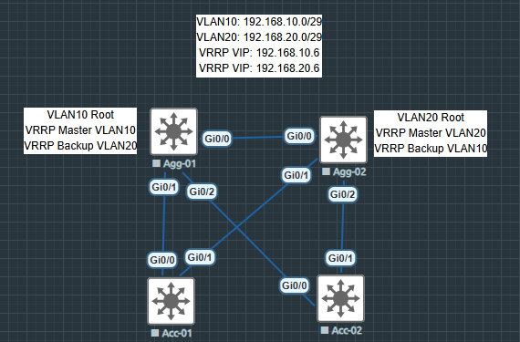

```
HSRP для транспортаиспользует UDP IPv4: 1985; UDP IPv6: 2029; Mcast address: 224.0.0.102
```

```
VRRP это вложение в IP номер 112 Mcast address: 224.0.0.18; Может в качестве VIP использовать адрес IP интерфейса
```

```
VMAC формируется на основе IP и номера группы
```

```
HSRP VMAC 0000.5e00.01XX; где XX это номер группы
```

```
По возможности роли HSRP (VRRP) должны быть синхронизированны с ролью STP. Т.е. root за VLAN 10 должен быть Master за этот VLAN 10. В противном случае трафик будет ходить не оптимально.
```



```
Master выбирается относительно приоритета, чем выше приоритет относительно опонента, тем больше шансов стать Master
```

```
preemtion - возврат в предудыщее состояние после смены роли. Т.е. если изначально сконфигурирован, как Backup и после потери Master сам становится Master, но как только связь будет восстановлена, снова станет Backup
В CISCO preemt включен по умолчанию
```

```
Группа нужна для синхронизации состояния ролей устройств, которые в ней находятся
```
### Example

```
Agg-01
interface Vlan30
 ip address 10.10.30.251 255.255.255.0
 ip helper-address 10.10.100.1
 ip ospf authentication message-digest
 ip ospf message-digest-key 10 md5 NSP
 vrrp 30 ip 10.10.30.254
 vrrp 30 priority 150
end
```

```
Agg-02
interface Vlan30
 ip address 10.10.30.252 255.255.255.0
 ip helper-address 10.10.100.1
 ip ospf authentication message-digest
 ip ospf message-digest-key 10 md5 NSP
 vrrp 30 ip 10.10.30.254
 vrrp 30 priority 50
end
```

